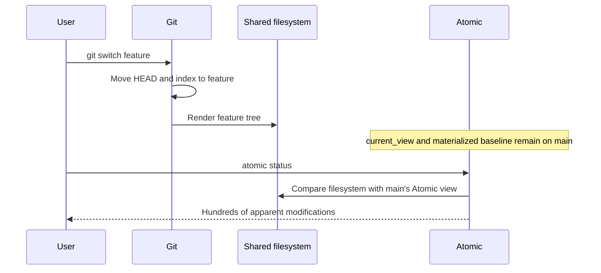
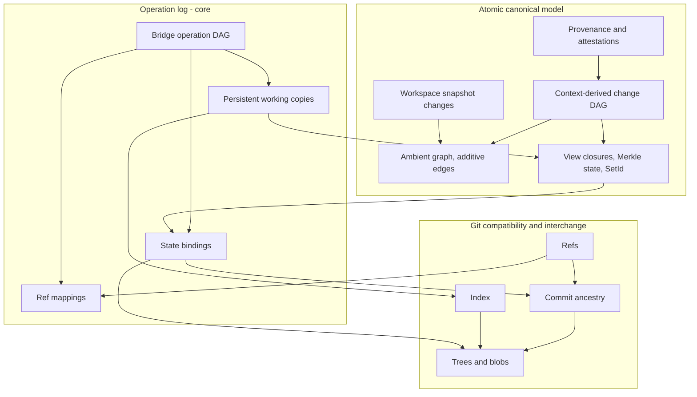
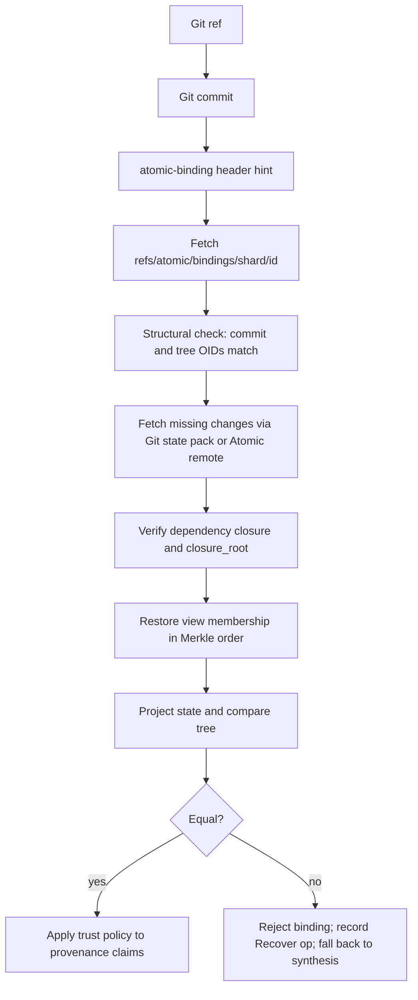

# RFC: Atomic Git Causal Bridge and Colocated Workspace Reconciliation

- **Status:** Proposed — revision 3
- **Author:** Atomic Team
- **Date:** 2026-09-02
- **Severity:** Critical — prevents stale-baseline misclassification, mixed materializations, and agent provenance loss
- **Components:** `atomic-core`, `atomic-repository`, `atomic-cli`, `atomic-agent`, `atomic-remote`, `atomic-config`, `atomic-identity`, Git interoperability
- **Supersedes:** The unidirectional-policy assumption in `SPEC-single-materializer-validator.md` §5.4; the alias/link model in `git-shadow-tasks.md`
- **Builds on:** `git-import-design.md`, `SPEC-single-materializer-validator.md`, `publication-manifest-design.md`, `attestation-design.md`, `view-snapshot-sync-design.md`
- **Prior art:** Jujutsu colocated Git workspaces, working-copy commits, and operation log; Entire sessions, temporary shadow refs, and per-checkpoint refs

**Revision history.** Revision 2 changed Atomic's core where mapping alone could not close the interoperability gaps. Revision 3 corrects the proposed core algebra and Git model after implementation-grounded review: snapshot changes are complete patches against the durable baseline; attributes are causal multi-value registers; the existing additive `SetId` wire contract is retained; causal awareness uses an explicit frontier rather than `extra_known` heads; repository, index, and worktree states are distinct; partial staging has a first-class workspace index model; local hooks cannot guarantee remote publication; and all format/schema migrations and phase prerequisites are explicit. The goal remains the superset: users and agents choose either CLI per operation without choosing one VCS for the repository.

---

## 0. Glossary

Terms in this RFC are overloaded elsewhere in Atomic; the definitions below are normative for this document.

| Term | Meaning here | Not to be confused with |
|---|---|---|
| **Change** | A content-addressed Atomic patch (`Change`, `HashedChange`) with context-derived dependencies. | A Git commit. |
| **Graph op** | A `GraphOp`/`Atom` inside a change (insertion, edge update, file add/move/del). | A bridge operation. |
| **Bridge operation** | An immutable record in the operation log describing a repository-state transition (import, export, switch, record, anchor, recover). | A graph op. |
| **View** | An ordered change-reference filter over the ambient graph (`VIEWS`, `VIEW_CHANGES`). | A Git branch. A workspace. |
| **Working copy** | A persistent `WorkingCopyRecord` for one directory: stable ID, desired/materialized state, staging state, and Git checkpoint. | `atomic_core::apply::Workspace`, the existing transient graph-application type. |
| **Workspace** | Reserved in code for `atomic_core::apply::Workspace`; prose may use it only in the generic user-facing sense. | The persistent working-copy record. |
| **Shelf** | Per-view storage of ignored artifacts swapped on view change. | Workspace. |
| **Snapshot change** | A `ChangeKind::Snapshot` change recording uncommitted working-copy content into a workspace-private view. | A Git stash. A durable change. |
| **Merkle state** | The order-sensitive rolling hash of a view's change sequence. | The set identity. |
| **Set identity (`SetId`)** | The order-insensitive identity of a view's effective change closure. | Merkle state. |
| **Binding** | A signed fact: Git commit `C` with tree `T` is the projection of Atomic set identity `S` (and a specific Merkle state). | A commit trailer. |
| **Manifest** | The canonical, complete description of a tree: paths, kinds, repository bytes, modes, link targets. | The Git index. |
| **Projection** | The canonical Git tree/commit generated from an Atomic state. | Materialization (writing files to disk). |
| **Adoption** | Accepting a filesystem already rendered by Git as the materialization of a resolved Atomic state without rewriting it. | Import. |
| **Resurrection** | Restoring the exact original Atomic closure behind a Git ref from a binding. | Synthesis. |
| **Synthesis** | Deterministically constructing new Atomic changes from Git snapshots when no binding exists. | Resurrection. |

---

## 1. Business Problem

Atomic and Git currently operate on the same working directory while retaining different beliefs about the state from which that directory was produced.

The observed failure is:

1. A user runs `git switch feature`.
2. Git moves `HEAD`, updates its index, and renders the feature tree.
3. Atomic's `.atomic/current_view` and materialized baseline remain on the previous state.
4. `atomic status` compares the feature filesystem against the old Atomic view.
5. Atomic reports hundreds of modifications while `git status` reports a clean checkout.
6. A later Atomic record, agent turn-end hook, view switch, or materialization treats the checkout as authored work, overwrites it, or produces a mixed tree.

The defect is a workspace identity defect, not a classification defect:

```text
Actual filesystem provenance:      Git commit feature@{0}, tree T_feature
Atomic's assumed provenance:       Atomic view main, state S_main
```

Atomic accurately calculates the difference between two states that should never have been compared.

### 1.1 Current failing sequence



### 1.2 Required sequence

```mermaid
sequenceDiagram
    participant User
    participant Git
    participant FS as Shared filesystem
    participant Bridge
    participant Atomic

    User->>Git: git switch feature
    Git->>Git: Move HEAD and index to feature
    Git->>FS: Render feature tree
    User->>Atomic: atomic status
    Atomic->>Bridge: Begin workspace transaction
    Bridge->>Git: Observe HEAD, index tree, refs
    Bridge->>Bridge: HEAD differs from workspace checkpoint
    Bridge->>Atomic: Resolve binding, resurrect closure (or synthesize)
    Bridge->>FS: Verify filesystem manifest equals Git tree
    Bridge->>Atomic: Adopt reconciled view/state as workspace baseline
    Bridge->>Bridge: Re-verify HEAD unchanged; publish ImportGitHead operation
    Atomic->>FS: Snapshot remaining edits; compute status
    Atomic-->>User: Clean
```

### 1.3 Atomic-origin transition

```mermaid
sequenceDiagram
    participant User
    participant Atomic
    participant Bridge
    participant Git
    participant FS as Shared filesystem

    User->>Atomic: atomic view switch feature
    Atomic->>Bridge: Begin workspace transaction
    Bridge->>Atomic: Snapshot pending edits into workspace snapshot change
    Bridge->>Atomic: Resolve target view state and set identity
    Bridge->>Git: Resolve or create projection commit and binding
    Bridge->>Git: Update HEAD/index with expected-old leases
    Atomic->>FS: Materialize target view (shelf swap included)
    Bridge->>FS: Verify complete manifest
    Bridge->>Bridge: Publish SwitchView operation and workspace checkpoint
    Atomic-->>User: Switched; git status and atomic status are clean
```

### 1.4 Managed agent using the Git CLI

```mermaid
sequenceDiagram
    participant Agent
    participant Git
    participant Bridge
    participant Atomic
    participant Prov as Provenance and attestation

    Bridge->>Bridge: Turn-start boundary (Atomic state, Git HEAD/index, manifest)
    Agent->>Atomic: Edits (snapshot changes accumulate)
    Agent->>Git: git add -p, git commit
    Git->>Git: Move HEAD; working tree clean
    Agent->>Bridge: Turn-end boundary
    Bridge->>Git: Detect HEAD/index transition
    Bridge->>Atomic: Split snapshot by committed manifest; bind commit to durable change(s)
    Bridge->>Atomic: Link binding, changes, operation to turn
    Atomic->>Prov: Finalize provenance graph; sign turn attestation
    Prov-->>Bridge: Coverage complete
    Bridge-->>Agent: Turn finalized (never EmptyTurn)
```

### 1.5 Business outcomes

1. **One interpreted workspace baseline.** Git, Atomic, and agent automation agree which state produced the current filesystem.
2. **Status coherence.** In synchronized states, `git status` and `atomic status` agree on clean/dirty and on ordinary path classifications.
3. **No mixed materialization.** Neither system renders over an unexplained state from the other.
4. **Exact causal recovery.** A Git ref exported from Atomic restores the original Atomic changes, dependencies, semantic identities, and provenance.
5. **Honest foreign import.** Git-native history becomes a valid, labeled Atomic causal interpretation.
6. **Mandatory agent evidence.** Every managed agent turn produces an Atomic record with provenance and attestation, including turns that used only Git commands.
7. **Superset, not either/or.** Users choose commands per task, never a VCS per repository.
8. **Safe convergence.** Interrupted synchronization is recoverable from immutable operations; nothing requires deleting `.atomic` or `.vault`.

---

## 2. Decision Summary

Atomic replaces the Git Shadow model with an **Atomic Git causal bridge** for explicitly configured colocated workspaces, and changes its core to make the bridge sound.

### 2.1 Three graphs, one operation log



### 2.2 Governing equivalence invariant

After every successful bridge boundary, for the workspace's baseline:

```text
Projection(AtomicState).tree == Binding.git_tree == Manifest(filesystem minus pending edits)
```

and for a clean workspace:

```text
git status clean ⇔ Git index stage 0 equals bound HEAD tree and Git reports no worktree/index delta under its conversion+sparse policy
                  ⇔ Atomic independently reports no repository/index/worktree delta under the same policy fingerprint
```

Git's index is a compatibility layer:

```text
Git:     HEAD tree → index tree → filesystem
Atomic:  baseline state → snapshot change(s) → filesystem
```

### 2.3 Authority

| Concern | Authority |
|---|---|
| Native causal operations, dependencies, semantic identity, provenance, attestations | Atomic |
| Git-native commands that already moved HEAD, index, refs, or files | Git, as evidence to be adopted |
| The last mutually synchronized workspace state | The operation log |
| Repository content bytes | Repository (post-`clean`) bytes — identical in Git blobs and Atomic vertices |
| Content correctness of a binding | Recomputation (project and compare trees) — never the signature alone |
| Provenance/authorship claims in a binding | Signature under the trust policy |

Neither `.atomic/current_view` nor Git `HEAD` alone identifies the baseline. Both are replaced/qualified by the workspace record.

### 2.4 Operating mode

This RFC specifies exactly one mode:

```toml
[git]
mode = "colocated"      # .git and .atomic share one working directory
authority = "atomic"    # Atomic owns causal history; Git is projection + evidence
```

An Entire-style "Git-authority sidecar" mode (Git owns history, Atomic observes) is explicitly **out of scope**; it cannot satisfy outcomes 2 and 4 and would need its own RFC. Legacy Shadow behavior is disabled when `mode = "colocated"` is enabled (§14).

---

## 3. Atomic Core Changes

These changes are required for correctness and are owned by this RFC. Each is used by later bridge sections.

### 3.1 Persistent working copies (replaces `current_view` and `working_copy_id`)

Atomic already has a transient `atomic_core::apply::Workspace`; the persistent type is deliberately named `WorkingCopyRecord`. Add pristine table `WORKING_COPIES` and per-directory identity file `.atomic/working_copy_id`. Existing empty `working_copy_id` files are populated during migration; linked Git worktrees receive distinct records, and duplicate IDs caused by copied directories are detected from the canonical path plus Git worktree administrative identity.

```rust
struct WorkingCopyRecord {
    id: WorkingCopyId,                // ULID; one per working directory / Git worktree
    desired_view: ViewId,
    desired_state: Merkle,
    materialized_state: Option<Merkle>,
    materialized_manifest: Option<ManifestHash>,
    snapshot_view: ViewId,            // working-copy-private view (§3.3)
    staged: StagingState,              // mirrors Git index without mutating durable TREE (§3.4)
    git: Option<GitCheckpoint>,       // None when no Git backend
}

struct GitCheckpoint {
    head: Option<Oid>,                // resolved commit
    head_symref: Option<String>,      // e.g. refs/heads/main, or None when detached
    index_tree: Option<Oid>,
    refs_hash: Hash,                  // hash of observed mapped refs (§8)
    git_common_dir: PathBuf,
    git_worktree_dir: PathBuf,
    git_index_path: PathBuf,
    conversion_policy: Hash,          // attributes/config/filter/capability fingerprint (§6)
}
```

`desired_*` versus `materialized_*` makes stale working copies detectable. `.atomic/current_view` becomes a derived compatibility file only after every working-copy-aware repository API accepts a `WorkingCopyId`; bare repositories use view-scoped APIs and have no working-copy record. Git paths are resolved through `git rev-parse --git-common-dir`, `--git-dir`, and `--git-path`, never by assuming `.git/` is a directory.

### 3.2 Operation log

New content-addressed table `OPERATIONS` plus `OP_HEADS`.

```rust
struct Operation {
    id: OperationId,                  // Blake3 of canonical encoding
    parents: Vec<OperationId>,        // >1 when concurrent heads are merged
    kind: OperationKind,
    working_copy: Option<WorkingCopyId>,
    before: RepoStateRef,             // excludes any pointer to this operation
    delta: RepoStateDelta,             // intended immutable transition; no self-reference
    git_observed: Vec<GitRefObservation>,
    evidence: Vec<Hash>,              // bindings, hook events, provenance roots
    actor: ActorRef,                  // human DID, agent DID + session/turn
    timestamp: i64,
    lossy: Vec<LossNote>,
}

enum OperationKind {
    Anchor, Record, PromoteSnapshot, SplitSnapshot, SwitchView, Materialize,
    ImportGitHead, ImportGitRefs, ExportGitRefs, ProjectState,
    SynthesizeGit, ResurrectBinding, Insert, Unrecord, Tag,
    Recover, Undo, Gc,
}
```

`OperationId` hashes only immutable intent (`before` + `delta`); `WorkingCopyRecord.last_operation` is maintained in `OP_HEADS`/working-copy storage outside that hash, avoiding an operation↔working-copy hash cycle. External effects are recorded as separate immutable `EffectReceipt` objects (§7.2), never by mutating an operation phase in place.

Commands: `atomic op log`, `atomic op show`, `atomic op undo [<id>]`, `atomic op restore <id>`. Undo applies an inverse metadata delta and re-projects Git; it never deletes changes or Git objects. Concurrent heads are not automatically called "merged": commutative metadata deltas consolidate under a multi-parent operation, while competing working-copy/view/ref deltas remain explicit conflicts with no implied `after` state.

### 3.3 Working-copy snapshot changes

Atomic gains a first-class representation of uncommitted work, analogous to jj's working-copy commit but expressed as a patch.

```rust
enum ChangeKind { Durable, Snapshot }

// In ChangeHeader (hashed):
kind: ChangeKind,
supersedes: Option<Hash>,             // previous snapshot for this workspace
```

Rules:

1. Each persistent working copy owns a private draft view `wc/<working_copy_id>` whose parent is the working copy's desired view.
2. A **snapshot** is a real change assembled by the normal record/globalize machinery, but always against the durable desired-view filter **excluding every earlier snapshot**. It is therefore the complete patch `durable baseline → current cleaned worktree`, not the incremental patch `previous snapshot → worktree`.
3. Snapshot replacement is one transaction: first assemble the complete new snapshot against the baseline-only filter; prove its graph contexts resolve without snapshot vertices and `dependencies ∩ snapshot_hashes = ∅`; prove no remaining visible change depends on the old snapshot; then replace the view reference. If any proof fails, keep the old snapshot and abort. The superseded change remains an operation/GC root while referenced by recovery or an incomplete session.
4. Snapshot changes are never inserted into Shared views, never pushed to Atomic remotes by default, and never appear in `atomic log` without `--snapshots`.
5. **Promote** (`atomic record`): the durable change is assembled from the same recorded files against the baseline filter (excluding the snapshot), gets a durable header/provenance, and the snapshot is dropped. Dependencies are recomputed by globalization, so promotion never carries a snapshot hash as a dependency.
6. **Split** is a new repository operation. Existing diff/CLI splitting may be reused, but Atomic has no repository-level graph-safe `Repository::split` today. `split_snapshot(index_manifest)` separately re-assembles the staged durable patch (`baseline → index`) and remaining snapshot (`new durable baseline → worktree`) from bytes, remapping content ranges and regenerating graph ops, semantic `FileOps`, dependencies, causal frontier, provenance coverage, and manifests. It never partitions serialized atoms in place.
7. Snapshots are what "snapshot remaining filesystem changes" means after Phase 2. Phase 0 cannot use this primitive yet and preserves bytes only through a WIP ref plus an incomplete-session marker.

This closes: undefined snapshot semantics, edits carried across a Git checkout, detached-HEAD recording (§7.5), fail-closed data loss, and partial staging.

### 3.4 Workspace staging model

Git has three states; Atomic must not collapse them:

```rust
struct StagingState {
    baseline_manifest: ManifestHash,   // durable Atomic state / Git HEAD
    index_manifest: ManifestHash,      // Git stage-0 entries and modes
    index_metadata: IndexMetadata,     // intent-to-add, skip-worktree, assume-unchanged, sparse entries
    worktree_snapshot: Option<Hash>,   // complete baseline→worktree snapshot
}
```

`TREE` remains durable repository identity and is never mutated merely because `git add`, `git reset`, or `GIT_INDEX_FILE` changed an index. The working-copy staging record mirrors the primary worktree index. Alternate indexes are observed as foreign commit evidence but do not replace the primary staging record. Atomic adds explicit `atomic stage`/`atomic unstage`; `atomic add` means begin durable tracking in native mode and, in colocated mode, creates an intent-to-add entry without claiming content is staged. Ordinary snapshot changes project to the worktree only; only `index_manifest` projects to the Git index.

### 3.5 Inode attributes in the graph

Today file mode and symlink-ness are not represented as graph facts, so Git executable-bit and symlink changes cannot round-trip. Add:

```rust
enum InodeKind { File, Symlink, Directory, Submodule }

// New GraphOp
GraphOp::SetAttr {
    inode: Position<H>,
    attr: InodeAttr,                  // Kind(InodeKind) | Executable(bool) | SubmoduleTarget(GitOid)
    edge: EdgeUpdate<H>,              // attribute vertex chain: additive, view-filtered like content
}

// Semantic layer
TrunkOp::SetKind { trunk: TrunkId, kind: InodeKind }
TrunkOp::SetExecutable { trunk: TrunkId, executable: bool }
```

Each attribute is a causal multi-value register in the graph. `SetAttr` inserts a value vertex and adds deletion edges for every **known live** predecessor value. One live value means resolved; multiple causally incomparable live values are an attribute conflict; view sequence order never selects a winner. Legacy absence has explicit defaults (`kind=File`, `executable=false`). The operation is defined in terms of an `Insertion` for the value vertex plus `EdgeUpdate`s for replaced values and requires serialization, globalization, apply, retrieval, conflict, materialization, and dual-index support. Directories already have `DirAdd/DirDel/DirUndel` and `DIRECTORIES`; directory kind remains owned by those graph operations, while the new register covers file/symlink/submodule kind and executable mode. Symlink target bytes are inode content. Submodules are gitlink targets; Atomic does not recurse.

Status codes `P` (permissions) and `T` (type) become graph-backed instead of index-only.

### 3.6 Hashed change classification and origin

Imported changes currently carry Git metadata only in `unhashed`, so a synthesized change is indistinguishable from native work.

```rust
// In ChangeHeader (hashed)
origin: ChangeOrigin,

enum ChangeOrigin {
    Native,
    GitSynthesized { commit: Oid, parents: Vec<Oid>, derivation: Derivation },
    GitResolution  { merge_commit: Oid, parents: Vec<Oid> },   // §5.3
}

enum Derivation { Root, FirstParent, MultiParent, Squash, EmptyCommit, RewriteCandidate }
```

`ChangeKind` is the lifecycle class (`Durable` or `Snapshot { working_copy: WorkingCopyId }`); `ChangeOrigin` is provenance (`Native`, `GitSynthesized`, `GitResolution`). They are separate and validation rejects impossible combinations. Unhashed metadata keeps mutable/expensive parts.

### 3.7 Order-insensitive state identity

`SetId` already exists and its shipped wire contract is retained:

```text
SetId(S) = Σ four-lane_digest(Blake3("atomic:setid:v1" || change_hash))
```

This RFC does not replace it with `Blake3(sorted(...))`. Define one canonical helper `effective_projection_closure(view)` used by materialization, `SetId`, bindings, and export. It follows the actual Draft/Shared parent semantics and requires every valid view to contain its dependency closure explicitly; bridge enable repairs/rejects legacy views before binding. The existing `collect_visible_change_ids`/`view_set_id` behavior is audited so the identity domain exactly equals the materialization filter domain.

`SetId` is a convergence hint, not a trust boundary. Bindings carry and verify the ordered closure and projected tree independently. The RFC requires a property proof/test: for any valid dependency-closed set, repository content, attributes, semantic state, and persisted conflicts are independent of topological application order. Only after that property holds may different Merkle orders share a tree binding; Git commit identity remains operation-specific.

### 3.8 Repository bytes and the content-filter pipeline

Decision: **Atomic stores repository bytes** — exactly the bytes Git stores in blobs (post-`clean`, pre-`smudge`). Consequences:

- Materialization applies Git's `smudge`/`eol`/`text` semantics (from `.gitattributes`, `core.autocrlf`, `core.eol`) when writing to disk in colocated mode; snapshotting applies `clean` when reading.
- LFS-managed files are recorded as pointer files; LFS object transfer stays with Git LFS. `atomic-repository` gains a `ContentFilter` trait with a `GitAttributesFilter` implementation (pure Rust for `eol`/`text`/`ident`; external `filter` drivers invoked via the Git process filter protocol).
- The manifest (§6) hashes repository bytes, so Atomic materialization and Git checkout produce the same manifest on every platform.

### 3.9 No refusal of Git-tracked content

In colocated mode Atomic never refuses to record a path Git tracks. Size/binary policies switch from *refuse* to *opaque single-vertex recording* with a warning; the CRDT layer records an opaque trunk. This makes every Git-tracked path representable in Atomic; durable/index/worktree tracking relations remain distinct (§3.4, §9.3).

### 3.10 Causal frontier for synthesized resolutions

Current `Change::knows` tests direct membership in `dependencies` or `extra_known`; parent heads do not imply knowledge of their closures. Add a hashed `CausalFrontier` containing closure roots plus a verified frontier index used by conflict detection to answer whether an `introduced_by` change is in a known parent closure. Applying a frontier-bearing change requires the complete referenced closure/index locally. `extra_known` remains for direct hashes, and its existing V3 deserialization loss is fixed with round-trip fixtures before either mechanism is used. Synthesized merge resolutions carry every parent closure root in the frontier; they do not copy Git parents into context dependencies.

### 3.11 Empty directories

Atomic tracks directories (folder vertices, `DIRECTORIES`); Git cannot represent empty ones. Policy: directories are projected only through their files; an Atomic directory with no alive files is omitted from the projection and marked `LossNote::EmptyDirectory` in the binding. Import never creates directory-only inodes.

### 3.12 Native tree, lifecycle, and materialization prerequisites

The bridge makes existing native defects observable across two CLIs; it must not encode workarounds for them. The following findings are prerequisites owned by Atomic core/repository, independent of Git.

| # | Finding | Audit verdict | Normative correction |
|---|---|---|---|
| N1 | Nested `FileAdd`/`DirAdd` use `ROOT` parent context | Confirmed | Globalization resolves the actual parent path through tree→inode→position, adds its introducing change as a dependency, and uses the parent directory inode anchor. Only top-level entries use `ROOT`. |
| N2 | Explicit directories collected/materialized as files | Confirmed | Tree collection queries directory graph/metadata and emits an explicit directory item. Explicit empty directories materialize; inferred ancestors may still be pruned. |
| N3 | `DIR_EMPTY` maintenance has no callers | Confirmed | `DIRECTORIES`/`DIR_EMPTY` become a derived index maintained centrally by tree projection. Every add/delete/move/undelete recomputes affected parents from visible direct children; callers never toggle flags ad hoc. |
| N4 | `DirDel` targets an inode self-edge rather than `DirAdd` structure | Confirmed | Derive deletion edges from actual adjacency and delete the parent→name and/or name→inode structural claims created by `DirAdd`; no synthetic inode self-loop. |
| N5 | `FileUndel`/`DirUndel` restore edges but not always path/inode/directory indexes | Partial but real | Undelete carries stable original inode/name identity; one operation-aware tree projection restores `TREE`, `INODES`, directory cache, and parent occupancy. Metadata retained by another view is verified, not assumed. |
| N6 | Permission-only changes have no durable operation | Confirmed | The causal attribute register (§3.5) records executable mode, semantic `SetExecutable`, status, apply, and `WorkingCopy::set_permissions` materialization. |
| N7 | Symlink type/target are not preserved | Confirmed | Walk uses `symlink_metadata` + `read_link`, records symlink kind/target, and output gains `create_symlink` with platform capability policy. |
| N8 | Gitlinks/submodules have no native representation | Confirmed | Attribute register records `Submodule(GitOid)`; import no longer skips mode `160000`; materialization retains a gitlink and never emits a regular file. |
| N9 | Rename-plus-edit may lose stable identity | Partial | Add native `record_moved_file` carrying `TrunkOp::Move` plus content edits on the same inode. Watcher/file identity and verified bindings are authoritative; similarity is `ProbableMove`, and fallback loss is surfaced. |
| N10 | Name-conflict resolution clears cache without resolving graph claims | Confirmed | Stored conflict retains claimant/name-edge identities. Recording a marker-free result emits `SolveNameConflict` (delete/redirect losing graph claims) plus chosen content; clear `CONFLICTS` only after the durable operation applies. |
| N11 | Empty file conflated with absent/filtered content | Confirmed | Replace `Option<Vec<u8>>` output semantics with `MaterializedEntry::{Absent, Present { bytes, ... }}`. `Present { bytes: [] }` creates/truncates and indexes an empty file. Content retrieval returns `Some(empty)` for a tracked empty file. |
| N12 | `REV_TREE` is both reverse index and implicit same-path claim ledger | Partial, structurally unsafe | Keep `REV_TREE` strictly bijective; add `PATH_CLAIMS: path → (inode, name-edge, introduced_by, resolution)` multimap. Name conflict discovery uses visible live claims; `put_tree` atomically updates both sides or refuses collision. |
| N13 | Materialization/content retrieval use different visibility closures | Confirmed | Add type-level `ViewMembershipSet` and `GraphVisibilityClosure`. One canonical dependency-expanded builder feeds every graph traversal/materialization/content/status/record path; plain membership is legal only for view-log operations. Legacy unindexed dependencies fail closed or are repaired. |

The architectural rule is:

```text
Ambient graph + view/dependency closure = source of truth
TREE / REV_TREE / PATH_CLAIMS / INODES / DIRECTORIES / CONFLICTS = transactional projections or caches
```

Record, import, insert, undelete, unrecord/reinsert, and view replay all call one operation-aware tree projection API. No command maintains these indexes independently.

---

## 4. Atomic Causal Graph Constraints (unchanged and reaffirmed)

The bridge uses the existing record pipeline rather than bypassing it:

```text
repository bytes → minimal line diff → BuiltHunks → globalize against the filtered graph
→ predecessor/successor positions → dependencies from introducing changes → Change
→ additive graph application → view membership, Merkle, SetId
```

Code: `atomic-repository/src/repository/record.rs`, `atomic-core/src/record/workflow/{compare.rs,graph_op/builder.rs,assembly/mod.rs,globalize/}`, `atomic-core/src/change/atom.rs`, `atomic-core/src/apply/`, `atomic-repository/src/apply/mod.rs`, `atomic-repository/src/repository/filter.rs`, `atomic-core/src/output/alive/retrieve/mod.rs`, `atomic-repository/src/repository/materialize.rs`.

Invariants the bridge must respect:

1. Dependencies are context-derived. Git parents go into `ChangeOrigin`/bindings, never into `dependencies`.
2. Deletion is additive (`BLOCK | DELETED` alongside the original edge); visibility is by `introduced_by ∈ filter`.
3. Positions are ambiguous; use `find_block_end` for up-context and `find_block` for down-context — synthesis must go through `assemble_change`/`write_change_to_graph`, not hand-built edges.
4. A binding is valid only if materializing the bound closure yields the bound tree.
5. Synthesized changes must also emit semantic `FileOps` so blame/word-diff work on imported history.
6. Every graph traversal consumes `GraphVisibilityClosure`; `ViewMembershipSet` can never satisfy the materialization/retrieval API type.
7. File presence is explicit and independent of content length; zero bytes never mean absent.
8. Path claims and durable conflict resolutions are graph facts; flat reverse indexes and `CONFLICTS` cache cannot be their authority.

---

## 5. Exact Resurrection and Foreign Synthesis

### 5.1 Bindings

```rust
struct GitStateBinding {
    id: BindingId,                    // Blake3 of canonical encoding
    version: u32,

    git_object_format: GitObjectFormat,
    git_commit: GitOid,
    git_tree: GitOid,
    git_parents: Vec<GitOid>,         // ordered, complete
    raw_commit_object: Option<Vec<u8>>, // every foreign commit if it must survive loss of Git ODB

    set_id: SetId,
    merkle_state: Merkle,             // order restoration
    view_hint: Option<String>,        // name only; not identity
    ordered_changes: Vec<Hash>,       // effective closure in Merkle order, snapshots excluded
    closure_root: Hash,               // Blake3 over ordered_changes

    operation: OperationId,
    origin: CausalOrigin,
    loss: Vec<LossNote>,

    provenance_roots: Vec<Hash>,      // hashes only; content never enters Git refs (§5.6)
    attestation_roots: Vec<Hash>,

    signer: Did,
    signature: Signature,
}

enum GitObjectFormat { Sha1, Sha256 }
enum GitOid { Sha1([u8; 20]), Sha256([u8; 32]) }

enum CausalOrigin {
    ExactAtomicResurrection,
    ForeignGitRoot, ForeignGitFirstParent, ForeignGitMultiParentMerge,
    ForeignGitSquash, ForeignGitEmptyCommit, ForeignGitRewriteCandidate,
    Lossy,
}
```

Bindings are immutable facts about a Git commit. `unrecord`/`insert` create a new state and, when projected, a new commit and binding; old bindings stay valid for old commits.

### 5.2 Exact resurrection



Content correctness never depends on the signer: the tree is recomputed. The signature only gates whether provenance/attestation roots are trusted (§5.6).

### 5.3 Foreign synthesis

When no valid binding exists:

1. Preserve full ordered parents and tree OIDs in `ChangeOrigin` and the `SynthesizeGit` operation.
2. Resolve the complete imported closure first, then traverse in deterministic topological order (ties broken by committer time, then tagged OID); label the order as bridge sequencing. Shallow/promisor boundaries are explicit and no prior sequencing is silently reinterpreted when history is deepened.
3. Root and single-parent commits: diff against the parent's synthesized closure, run through `assemble_change`.
4. **Multi-parent merges:** replace the current first-parent-only `ParsedCommit.parent_index` path with complete ordered parents; import every parent closure; build the union view; derive a `GitResolution` change from union state to merge tree carrying each parent's `CausalFrontier` (§3.10). Verification is object/tree-based in an isolated graph/tree builder, never by materializing into the active worktree. A `GitResolution` is never replayed automatically when the same conflict recurs in another view (§18).
5. **Empty commits:** produce a `Change::empty` whose hashed `GitSynthesized` origin includes the tagged Git OID, ordered parents, tree OID, raw author/committer identity+times, and `Derivation::EmptyCommit`, so distinct empty Git commits cannot collapse; no graph facts.
6. **Squash without trailers:** one `Squash`-derived change; if a prior binding for any commit in the squashed range exists locally, create a `RewriteCandidate` link for review — never identity.
7. Emit semantic `FileOps` alongside graph ops.
8. Path continuity preserves a synthesized inode. A verified Atomic binding restores original inode identity. Git similarity alone yields `ProbableMove` evidence; it may choose a deterministic `FileMove` under policy but is never exact identity. Ambiguous cases are delete+add with `LossNote::RenameUnresolved`.
9. Modes/symlinks/submodules → attribute-register ops (§3.5). `RepoPath` stores raw non-NUL/non-`/` bytes; percent/quoted encoding is display-only and reversible.
10. Every synthesized state is verified by projection against its Git tree before the next commit is processed.

### 5.4 Rewrite identity

| Evidence | Interpretation |
|---|---|
| Binding names predecessor binding | Authoritative evolution |
| `post-rewrite` event during an active captured operation | Authoritative operation linkage; change identity still requires binding verification or explicit review |
| `reference-transaction` event | Authoritative evidence only that a ref moved; never rewrite identity |
| Same `atomic-binding` header + verifying tree | Authoritative |
| Patch-id/tree/message/author similarity | `RewriteCandidate` only, surfaced in `atomic bridge review` |
| Git ancestry only | Storage ancestry |

### 5.5 Identity mapping

```toml
[git.identity]
"lee@atomic.dev" = "did:atomic:U4NN…"
```

Exported commits: author/committer from Atomic identity (name/email from `Identity`), plus headers `atomic-author <did>` and, for agent turns, `atomic-agent <did>` and a `Co-authored-by:` trailer. Imported commits: email → DID via the map; unmapped emails create a `did:atomic:git:<email-hash>` foreign identity flagged in provenance.

### 5.6 Trust and privacy

- **Trust policy** (`[git.trust] signers = [...]`, default: repository identity + configured collaborators). A binding from an unknown signer is used for content (recomputed) but its provenance/attestation roots are marked `untrusted` and cannot satisfy publication gates (§12.4).
- **Privacy:** Git refs carry only hashes — `provenance_roots`, `attestation_roots`, and a signed attestation *summary* (model vendor/name, token counts, cost, session ID). Transcripts, prompts, decision graphs, and `unhashed` bodies never enter Git objects; they travel via Atomic remotes. WIP refs (§6.4) contain repository bytes only for tracked paths and are never pushed.

---

## 6. Manifest and Tree Equivalence

### 6.1 Five-layer state model

The bridge never collapses these layers:

1. `AtomicDurableState` — view closure and graph facts.
2. `RepositoryManifest` — canonical Git-tree projection: raw path bytes, repository bytes, kind, mode.
3. `GitIndexState` — stage 0 plus intent-to-add, skip-worktree, assume-unchanged, sparse-index and stages 1–3.
4. `WorktreeObservation` — physical files, stat data, worktree bytes, and platform representation.
5. `AtomicSnapshotState` — pending causal patch plus provenance.

```rust
struct RepositoryEntry {
    path: RepoPath,                   // raw bytes; display escaping separate
    kind: InodeKind,
    repository_content: Hash,         // post-clean bytes / Git blob content
    executable: bool,
    gitlink: Option<GitOid>,
}
struct WorktreeEntry {
    path: RepoPath,
    physical_kind: PhysicalKind,
    worktree_content: Hash,
    repository_content_after_clean: Result<Hash, FilterError>,
}
struct ConversionPolicy {
    attributes_tree: GitOid,
    relevant_git_config: Hash,
    filter_driver_versions: Vec<Hash>,
    platform_capabilities: Hash,
    object_format: GitObjectFormat,
}
```

### 6.2 Policy table

| Concern | Decision |
|---|---|
| Byte source | Repository manifest uses post-clean bytes; worktree observation records physical bytes separately. Where possible Git plumbing/temporary indexes are the conversion authority. External filters run sandboxed with timeout/output limits; missing required or nondeterministic filters block adoption. |
| LFS | Pointer bytes are repository content; worktree verification uses Git's clean/process filter. LFS objects are needed for smudged materialization, not tree verification. |
| Modes | Repository/index modes remain authoritative. With `core.fileMode=false`, physical mode changes are ignored unless explicitly staged; existing `100755` entries remain executable. |
| Symlinks | Repository kind remains `120000`; `core.symlinks=false` is a workspace capability whose physical representation is a regular file containing target bytes, not repository-state loss. |
| Submodules | Recorded as gitlinks; never recursed. |
| Empty directories | Not projected (§3.11). |
| Case-insensitive FS | Manifest is case-sensitive; collisions are `Conflict::PathCase`, materialization refuses, status shows `C`. |
| Unicode normalization | Path identity is raw bytes; NFC/NFD is used only for collision detection/display on filesystems that normalize. |
| Excluded paths | Reserved bridge-private paths (`.atomic/` and shelves) are forbidden from repository manifests. Ignore rules affect untracked discovery only and never exclude tracked entries. `.vault/` is private by default but may be tracked under explicit policy. |
| Tracking | Durable tree, index, and worktree sets are distinct (§3.4). Divergence may exist between boundaries and is repaired or surfaced, never claimed impossible. |
| Conflicts | Atomic graph conflicts may project to a **conflict snapshot commit** (§8.3), which is not a Git unmerged index state. Git stages 1–3 block adoption. |
| Sparse/prefix | Repository manifest is full-tree. Missing skip-worktree paths are sourced from the bound tree/index, never interpreted as deletions; sparse-index directory entries are expanded through Git before comparison. |

### 6.3 Incremental scanning

Manifest computation is incremental: a new versioned `FILE_INDEX_V2` (the existing table is fixed `[u8; 52]` and cannot be extended in place) stores filesystem device/inode, ctime, size and a `racy_after` timestamp (Git's racy rule: re-hash entries whose mtime ≥ index write time). Git's index stat cache is consulted read-only as a second opinion. Targets: clean `atomic status` on 100k tracked files < 500 ms warm, < 5 s cold. The fast path is O(candidate changed refs + paths) only while cached tree manifests and the conversion-policy fingerprint remain valid; cache miss, attributes/config/filter change, sparse-mode change, monitor invalidation, or repair may require O(tree + worktree).

The filesystem side of the scan is served by a `ChangeSource` abstraction with three tiers, selected automatically and overridable by `git.watch`:

| Tier | Source of "paths changed since token" | Requires | Selected when |
|---|---|---|---|
| `scan` | Incremental stat walk over `FILE_INDEX` | nothing | default; CI/containers |
| `fsmonitor` | Version-gated experimental candidate paths from Git's builtin fsmonitor integration (prefer asking Git to refresh/query its index; direct daemon query is not a stable public contract) | `core.fsmonitor=true`; supported Git build | integration probe succeeds |
| `watchman` | Existing `WatchmanTurnWatcher` (`atomic-agent/src/watcher/`), `query(since: clock)` | Watchman installed | Watchman socket reachable |

All tiers must produce the same manifest; they differ only in latency. Fsmonitor tokens are never part of the equivalence proof and Atomic owns its checkpoint. A tier's answer is a **candidate set**: every candidate is re-stat'ed/re-hashed under the racy rule, and a tier that reports an error, overflow, or unknown token degrades to `scan` for that transaction. Bridge mode therefore requires no additional software; see §11.2 for the recommendation.

### 6.4 WIP recovery refs

Before any transition that could lose pending edits, the bridge writes a Git-native snapshot `refs/atomic/wip/<workspace>/<op>` via `git update-ref --create-reflog` with compare-and-swap (Entire's pattern). It is a crash-recovery aid; once the corresponding snapshot change is durable, the ref is dropped. WIP refs are local (`remote.<name>.push` never includes them).

---

## 7. Workspace Transaction Protocol

Every working-copy-aware command runs inside `Repository::begin_workspace_txn(mode)`. Modes: `Reconcile` (default), `Observe` (read-only, no mutation; `--no-reconcile`), `Force` (explicit repair).

### 7.1 Entry

```text
1.  Acquire bridge lock (.atomic/bridge.lock), outermost before pristine write txns and shelf lock.
2.  Load the working-copy record; consolidate only commutative operation heads and surface competing heads as conflicts.
3.  Observe Git: HEAD (symref + oid), index tree, index.lock presence, sequence markers, mapped refs.
4.  Ask Git/libgit2 for repository state and resolve marker paths with `git rev-parse --git-path` (including sequencer, MERGE_HEAD, REBASE_HEAD, rebase-merge/apply, CHERRY_PICK_HEAD, REVERT_HEAD, AUTO_MERGE, BISECT_START/LOG) or index has stage>0 entries → mode-dependent: Observe reports,
    Reconcile refuses with remediation, Force is not allowed.
5.  If HEAD != checkpoint.head → reconcile HEAD (§7.3) BEFORE touching the filesystem.
6.  Snapshot remaining edits into the workspace snapshot change (§3.3) — WIP ref first (§6.4).
7.  Reconcile mapped refs (§8).
8.  Re-observe HEAD/index; if changed since step 3 → abort and retry (TOCTOU guard, max 3).
9.  Hand the command a WorkspaceTxn with resolved view, filter, baseline manifest, snapshot.
```

### 7.2 Exit

```text
1.  Compute desired Atomic state (view, Merkle, SetId).
2.  Resolve or create the projection commit and binding (§8.2).
3.  Persist a prepared operation and per-effect plan with old/new values and leases.
4.  Create/verify objects; replace the index under its lock; update refs in a Git ref transaction. These are separate resources — never described as one atomic Git transaction. Append an immutable `EffectReceipt` after each side effect.
5.  Materialize if Atomic owns the transition. Shelf moves use a collision-safe three-way plan (old shelf/current disk/target shelf) and never overwrite unexplained disk content.
6.  Verify repository/index/worktree state under the conversion policy; append a Verified receipt and update the working-copy checkpoint outside the operation hash.
7.  Drop superseded WIP refs; release lock.
```

Interruption leaves the immutable operation plus its effect receipts. Recovery rolls forward or back each effect only when its expected-old/current lease proves no newer external work would be overwritten; crash injection occurs before and after every external effect.

### 7.3 Git HEAD reconciliation and adoption

```text
head_changed(old, new):
  binding = lookup_binding(new) or fetch_binding(new)
  if binding and resurrect(binding) verifies:
      target_view = mapped view for binding (or ephemeral view §7.5)
  else:
      target_view = synthesize(new, base = last bound ancestor) → new/updated mapped view
  if Git reports stage-0 index and worktree clean relative to new HEAD under current filters/sparse rules:
      adopt: set materialized_state = target state; no file writes
  else if a pre-transition snapshot proves old HEAD/index/worktree and the carried edit:
      re-assemble that known edit against the new baseline; adopt only after verification
  else:
      capture all unexplained post-checkout differences as a new opaque snapshot with unknown pre-checkout attribution; never claim they were carried from the old baseline
  execute a collision-safe shelf plan; tracked/indexed paths are never shelved
  record ImportGitHead
```

### 7.4 Sequence operations and index conflicts

A Git merge/rebase in progress is a Git-owned transaction. The bridge does not model half-applied Git state: `atomic status` reports "Git operation in progress (merge)" plus what Git says; recording is refused; agent turn-end stores a snapshot only. When Git finishes (HEAD moves, markers gone), the next boundary imports the result (merge commit → §5.3 step 4).

### 7.5 Ephemeral views for detached and historical HEAD

Adopting a commit that maps to no named view creates a Draft view `git/<short-oid>` (parent: nearest bound Shared view, else none) and points the workspace at it. Recording on it works normally. If the user later checks out a named branch, the ephemeral view is retained for retention and GC'd if empty and unreferenced. If they create a branch (`git switch -c`), the ref mapping (§8) renames the view.

### 7.6 Materialization ownership

| Transition origin | Filesystem writer | Bridge |
|---|---|---|
| Atomic view/operation | Atomic materializer (with filters, shelf swap) | Align Git HEAD/index; verify |
| Git checkout/reset/switch | Git | Adopt (§7.3) before any Atomic scan |
| Editor/agent edits | Nobody yet | Snapshot at boundary |
| `git add` / `git rm --cached` | Git index | Observe into `StagingState`; never mutate durable `TREE` solely from index movement |
| Git commit | Git refs/index | Import/resurrect/split-bind, attribute turn |
| Git merge/rebase in progress | Git | Wait; refuse Atomic mutation |
| Concurrent unexplained mutation | None trusted | Stop; `SyncConflict` remediation |

---

## 8. Refs, Views, Tags, and Projection Policy

### 8.1 Mapping

```rust
struct RefMapping {
    view: ViewId,
    scope: ViewScope,
    local_ref: Option<String>,        // refs/heads/<name> for Shared; refs/atomic/views/<name> for Draft
    remote: Option<(String, String)>, // (remote, refs/heads/<name>)
    last_observed_local: Option<GitOid>,
    last_observed_remote: Option<GitOid>,
    last_exported: Option<GitOid>,
    status: RefSyncStatus,            // Synchronized | GitAhead | AtomicAhead | Diverged | Unrepresentable
}
```

| View scope | Git representation | HEAD when checked out |
|---|---|---|
| Shared | `refs/heads/<mapped-name>` (default: view name) | Symbolic to the branch |
| Draft (incl. agent `agent-<session>` and `wc/<id>` snapshot views) | `refs/atomic/views/<name>` (reachability + identity; not a branch) | Detached at the projection commit |
| Ephemeral `git/<oid>` | none beyond the original commit | Detached |

Publishing a Draft to a branch is explicit (`atomic view publish <view> --branch <name>` or `git switch -c`), never implicit. View rename/delete and branch rename/delete are reconciled through the mapping; a deleted Shared view leaves its branch untouched and the mapping `Unrepresentable`.

### 8.2 Projection commits

`ProjectTree(set_id, conversion_policy)` deterministically builds only the Git tree. `ProjectCommit(tree, parent_oids, operation_metadata, signing_policy)` is operation-specific and not deterministic from `SetId` alone. Default parentage is one parent: the previous projected state on that mapped ref. Selective Atomic `insert` remains one-parent with source-change binding metadata; a second parent is emitted only for an explicit whole-view merge publication after proving the result contains the complete source closure. Imported/resurrected commits preserve their original ordered parents. Author/committer/timestamps come from the operation; message = change message(s) plus headers:

```text
atomic-binding <binding-id>
atomic-set <set-id>
atomic-state <merkle>
atomic-author <did>
```

Snapshot changes describe the worktree only. The separate `index_manifest` projects to Git stage 0; partial staging is therefore preserved. Imported signed commits retain raw object bytes and are never reconstructed or re-signed. New projected commits are signed only after constructing the unsigned payload; signing is operation-specific, binding signatures remain separate, and required-signing failure blocks publication.

### 8.3 Conflict snapshot commits

An Atomic state with unresolved conflicts may project on a Draft ref to an ordinary Git commit whose tree contains marker-materialized files and an `atomic-conflict <conflict-set-hash>` header. This is **not** Git unmerged index state: Git status is clean for the committed markers and Git merge tools/stages do not apply. Exact restoration requires the binding pack to contain the complete Atomic conflict objects (identities, base/sides, modes, graph metadata); markers plus a hash are insufficient. Shared/remote export is refused unless `--allow-conflicts`.

### 8.4 Tags

Atomic tags (`TAG_RECORDS`, `MERKLE_CHAIN`) map to Git annotated tags `refs/tags/<name>` whose message carries `atomic-binding`. Git lightweight tags import as Atomic tags on the bound state. ReviewGate/aggregate tags are Atomic-only and project nothing.

### 8.5 Three-way reconciliation

For each mapping compare `(last_observed, current_git, current_atomic)`:

| Git moved | Atomic moved | Result |
|---|---|---|
| no | no | no-op |
| yes | no | import (resurrect or synthesize), fast-forward view |
| no | yes | export projection with expected-old lease |
| yes | yes | if Atomic contains Git's bound closure → export; if Git contains Atomic's → import; else `Diverged` — surfaced in status; resolved by `atomic view insert`/`git merge` then re-export |

Remote refs use `--force-with-lease`-equivalent semantics against `last_observed_remote`.

### 8.6 Transport

On enable: `git config --add remote.<r>.fetch '+refs/atomic/bindings/*:refs/atomic/bindings/*'` and `'+refs/atomic/views/*:refs/atomic/views/*'`. Bindings initially publish as create-only `refs/atomic/bindings/<shard>/<id>` refs (never updated); scale benchmarks may replace this with bounded append-only pack/index refs before default rollout. Each binding commit's tree holds `binding.cbor`, `attestation-summary.cbor`, and an optional `changes.pack` (V3 change files for closures not reachable from an Atomic remote). Hosts that reject custom namespaces require an Atomic remote or an explicitly degraded, UI-visible `refs/heads/atomic/bindings/*` fallback; it is not semantically equivalent. `atomic clone <git-url>` and `git clone` + `atomic init --adopt-git` both bootstrap via §7 anchoring. A configured Atomic remote is preferred for change objects; the pack is the fallback.

---

## 9. Status and Diff Semantics

### 9.1 Modes

- `atomic status` (native): baseline → filesystem; snapshot content is "pending".
- `atomic status --git`: a Git-inspired, versioned subset of staged (baseline → index) and unstaged (index → worktree) two-column codes; it does not claim full Git porcelain compatibility until every XY/unmerged/path-quoting/submodule case is specified.
- `atomic status --no-reconcile`: forensic; prints Atomic state, checkpoint, current Git state, filesystem manifest root, drift verdict.
- Status in `Reconcile` mode may create `ImportGitHead`/`ImportGitRefs` operations (jj semantics); it never materializes.

### 9.2 Parity table

| Scenario | `git status --short` | `atomic status --git` | `atomic status` |
|---|---|---|---|
| Synchronized clean | clean | clean | clean |
| Edit tracked file | ` M f` | ` M f` | `M  f` |
| `git add f` after edit | `M  f` | `M  f` | `M  f` |
| `git add -p` partial | `MM f` | `MM f` | `M  f` |
| New untracked file | `?? g` | `?? g` | `?? g` |
| `git add g` | `A  g` | `A  g` | `A  g` (tracked) |
| `chmod +x f` (fileMode on) | ` M f` | ` M f` | `P  f` |
| Replace file with symlink | ` T f` | ` T f` | `T  f` |
| After `git switch` (bound) | clean | clean | clean |
| Git merge in progress | `UU f` | `UU f` + notice | `C  f` + "Git merge in progress" |
| Unstaged Atomic marker materialization | ` M f` | ` M f` | `C  f` |
| Committed conflict snapshot | clean | clean + `atomic-conflict` notice | `C  f` from restored conflict metadata |

### 9.3 Tracking set parity

Durable Atomic tracking, Git HEAD, Git index, and worktree presence are distinct relations. `atomic add` creates durable tracking intent and an intent-to-add index entry; `atomic stage` stages content. Observed `git add`/`git rm --cached` update only `StagingState` until commit/import creates a durable Atomic change. Tracking divergence can exist between boundaries and through plumbing/alternate indexes; preflight repairs representable cases or surfaces an index conflict, and `atomic bridge verify` checks all layers.

### 9.4 Ignore policy

In colocated mode Git ignore sources are authoritative for untracked status parity. `.atomicignore` patterns not already represented are mirrored into a managed block in `.git/info/exclude` with explicit enable-time consent; otherwise Atomic reports an `ignore-policy divergence` instead of hiding files Git reports. Tracked entries are never excluded by ignore rules. Shelf (`[workspace] shelve/expose`) only affects what is swapped on view change and is reported under a separate `shelved` heading; Git sees shelved artifacts as ignored files.

---

## 10. Agent Provenance Guarantee

### 10.1 Turn boundaries

```rust
struct TurnBoundary {
    working_copy: WorkingCopyId, operation: OperationId,
    atomic_view: ViewId, atomic_state: Merkle, set_id: SetId,
    snapshot: Option<Hash>,
    git: GitCheckpoint,
    manifest: ManifestHash,
    session: SessionId, turn: TurnId, at: i64,
}
```

### 10.2 Outcomes

```rust
enum TurnOutcome {
    ContentChanges { durable: Vec<Hash>, snapshot: Option<Hash> },
    RepositoryOperations { ops: Vec<OperationId>, bindings: Vec<BindingId> },
    ObservationOnly { provenance: Hash },
}
```

`EmptyTurn` is removed. `ObservationOnly` uses semantic equality: timestamps are excluded; operation ancestry is examined to exclude benign observation-only operations from other workspaces; Git HEAD/index/ref targets, conversion policy, repository/worktree manifests, and agent-attributable operations must be unchanged.

### 10.3 Git commits made by the agent

1. Detect HEAD/index transition between boundaries.
2. If an authenticated pre-commit capture proves exact HEAD, primary index tree, working-copy ID, snapshot, turn, and conversion policy at commit time, split the snapshot by the index manifest into a native durable change and remainder. Classify it `ManagedGitCommitCaptured`, not `ExactAtomicResurrection`. Without that evidence (hooks bypassed, alternate index, plumbing, later edits), synthesize the Git commit, attribute only the observed operation to the session, and mark the session incomplete until reviewed; content overlap alone never proves authorship. This makes an agent's `git commit` a native Atomic record rather than a foreign import. An inseparable operation — one that cannot be reassembled into exact baseline→index and index→worktree patches — is governed by the §19 Q2 owner decision (2026-09-14): the commit is permitted, and Atomic records it ONLY as synthesis with observed-operation-only attribution plus a durable incomplete status requiring review, retaining recovery evidence. It is never attributed exactly, never approximated by a path-level split, and never classified `ManagedGitCommitCaptured` or `ExactAtomicResurrection`; finalization never reports complete coverage for such turns and protected publication stays blocked until reviewed (§10.4, §10.5). The pre-commit hook therefore MUST NOT reject a commit solely because the staged operation is inseparable: the Git commit is allowed to land, and the allow-as-incomplete consequences (nonzero turn/session finalization, durable incomplete status, blocked protected publication) are enforced on the Atomic side (§10.5).
3. Link bindings, changes, and operations into the turn's provenance graph before finalization.
4. Sign the turn attestation over: turn boundaries, outcome, bindings, operations, provenance roots.

### 10.4 Publication gates

At shared-view insertion, triage promotion, Atomic push, and Git ref export the local gate requires for every reachable managed-session change: hashed session envelope, provenance root present, turn attestation verifying under the trust policy, no `SessionStatus::Incomplete` marker, and no unexplained Git commit between the session's boundaries. Local Git hooks are advisory. Arbitrary `git push` can bypass them, so protected Git publication is guaranteed only by an Atomic-controlled remote, server-side pre-receive/update hook, or required CI/hosting status check that verifies bindings and attestations. Repositories without a trusted receiving boundary receive warnings, not a false guarantee.

### 10.5 Failure policy

Any failure in snapshot, capture, import, any split error other than the classified inseparability exception, provenance finalization, or attestation signing writes `SessionStatus::Incomplete { reason, unbound_commits, unrecorded_paths }` durably and returns non-zero to the hook; unsafe Git operations, authentication failures, and evidence I/O errors keep failing closed this way and are never silently turned into accepted or covered work. Turn-end never reports success with uncovered work. Recovery: `atomic agent repair <session>`. An INSEPARABLE operation — inability to reassemble the exact split (§19 Q2, approved 2026-09-14) — is NOT one of these hook failures: the pre-commit hook never rejects solely for inability to split, the Git commit actually lands, and the allow-as-incomplete consequences are enforced on the Atomic side instead — the turn/session finalization exits non-zero, the commit is recorded as synthesized with observed-operation attribution only, `SessionStatus::Incomplete` persists durably until reviewed, recovery evidence is retained, complete coverage is never reported, and protected publication gates refuse it until the review discharges it.

---

## 11. Git Hooks and Event Journal

Installed by `atomic git bridge enable` through a composable dispatcher only when Atomic owns the hook. Existing binaries, symlinks, Husky/pre-commit managers, and custom `core.hooksPath` are never edited in place; Atomic emits integration instructions instead. Paths honor Git common-dir/worktree-dir rules and use an absolute Atomic binary path for GUI clients:

| Hook | Purpose | Failure policy |
|---|---|---|
| `reference-transaction` (Git ≥ 2.28) | Journal ref transactions performed by hook-capable Git commands in this repository; boundary observation remains authoritative | Advisory; never blocks |
| `post-checkout`, `post-merge`, `post-rewrite`, `post-commit` | Append event and schedule deferred reconciliation after Git exits; never fetch/synthesize synchronously | Advisory |
| `pre-commit` | If a managed agent session is active and the staged tree is not covered by a snapshot → run snapshot first (so split-bind is possible) | Fails closed only for agent sessions and only for real failures (unsafe Git operations, auth, evidence I/O); never rejects solely because the staged operation is inseparable — the commit proceeds and Atomic-side finalization fails non-zero (§10.5) |
| `pre-push` | Verify required bindings are already remote or included in the same push; never start a nested push | Advisory unless repository policy explicitly requires local failure; server gate is authoritative |

Events are evidence for operations; correctness never depends on a hook having run. The legacy `post-commit → atomic git import --incremental || true` hook is removed on enable.

### 11.2 Watching policy (optional accelerator, never the guarantee)

The bridge does **not** rely on a filesystem or Git watcher to stay in sync. Correctness comes from command-boundary reconciliation (§7); hooks (§11.1) are evidence and a fast path. Watching exists only to make two things faster: the filesystem manifest scan (§6.3) and the *noticing* of external Git transitions between commands.

**Why a watcher cannot be the sync mechanism.** A watcher observing `.git` and the worktree sees partial states (a checkout is many file writes plus `index.lock → index → HEAD`), can miss events (sleep/wake, inotify overflow, network mounts, containers), can create feedback loops with the bridge's own projection writes, and would be one more uncoordinated writer — the root cause catalogued in `SPEC-single-materializer-validator.md` §2. jj uses Watchman only to speed up snapshotting; Entire uses hooks, not watchers. This RFC takes the same position.

**Rules for any watcher integration**

1. **Reuse the `FileWatcher` trait.** The Watchman client and `FallbackWatcher` already bracket agent turns with `clock` / `state-enter` / `state-leave`. Bridge transactions enter the Watchman state `atomic-bridge` for their duration so IDE plugins and the watcher itself can ignore bridge-originated writes.
2. **Reuse an available accelerator where possible.** Git's builtin fsmonitor may provide candidate paths through a version-gated adapter; Atomic keeps its own token/checkpoint and revalidates candidates. The two CLIs do not assume they consume the same token or freshness contract. `atomic git bridge enable` offers (prompted, since it edits `.git/config`) to set `core.fsmonitor=true` and `core.untrackedCache=true`. If Watchman is installed, Git's fsmonitor hook and Atomic's `WatchmanTurnWatcher` both use it automatically.
3. **Reactive reconciliation is quiescence-gated.** Repository metadata watches are wake-up hints only (including reftable backends); ref truth is always re-enumerated through Git APIs. The optional `atomic bridge watch` daemon observes paths resolved through Git's common-dir/worktree-dir APIs On change it waits for quiescence (no `index.lock`, no `refs/**/*.lock`, no sequence markers, ≥ 250 ms silence) and then runs exactly `begin_workspace_txn(Reconcile)` — the same code path and lock a CLI command uses. It has no mutation logic of its own.
4. **Reactive reconciliation mutates metadata only.** Like `atomic status` in `Reconcile` mode (§9.1), it may create `ImportGitHead` / `ImportGitRefs` operations and adopt a Git-rendered tree; it never materializes and never moves Git refs.
5. **Self-event suppression.** Bridge-initiated Git writes are journaled with their operation ID before they happen; events attributable to an in-flight or just-completed operation are ignored (Watchman `state-enter("atomic-bridge")` provides this natively; the native path uses the journal).
6. **Surface, don't act, when unsafe.** Drift the watcher cannot reconcile (Git sequence operation, `Diverged`, `Unanchored`) is journaled and, when a managed agent session is active, pushed into the session as a notice ("Git HEAD moved; workspace reconciling") before the agent's next tool call.
7. **Optional and degradable.** `git.watch = "off" | "auto" | "fsmonitor" | "watchman" | "native"`; default `auto` (fsmonitor → watchman → scan). `off` is fully correct. CI and containers default to `off`. The `native` tier (`notify` crate, in-process) is reserved for a later phase and is not shipped in the first release.

**Recommendation (user guide text)**

> Bridge mode requires no additional software. For repositories over roughly 50k files, Git's builtin filesystem monitor or Watchman may accelerate candidate-path discovery when the installed Git/Watchman integration passes Atomic's capability probe. Atomic always revalidates candidates and falls back to scanning. Leave monitoring off in CI and containers.

---

## 12. Safety Properties

1. No working-copy-aware command interprets files against a stale checkpoint.
2. HEAD is reconciled before the filesystem is scanned; HEAD is re-verified before adoption is committed.
3. After Phase 2, pending edits are captured in a complete baseline-relative snapshot change before a bridge-owned transition; Phase 0 provides WIP-ref-only preservation until snapshot support ships. Externally completed Git transitions without a pre-capture never receive invented pre-transition provenance.
4. Known bindings are resurrected, never re-synthesized; synthesis is labeled in the hashed header.
5. Complete manifest equivalence is verified, not touched paths.
6. Ref movement uses expected-old leases; divergence is explicit.
7. Materialization never proceeds across unexplained drift or an in-progress Git sequence operation.
8. Headers/trailers are hints; content correctness is recomputed; signatures gate provenance trust only.
9. Git ancestry lives in `ChangeOrigin` and bindings, never in `dependencies`.
10. Managed agent work cannot cross an Atomic-controlled or server-enforced publication gate without complete, trusted provenance; arbitrary Git publication to an unenforced server can only be detected and warned about.
11. Interrupted operations are recoverable and idempotent.
12. `.atomic`, `.vault`, shelves, and Git objects are never deleted as a repair strategy; GC respects retention roots.
13. Transcripts and prompts never enter Git objects.

---

## 13. Phased Implementation Plan

Phases are dependency-ordered workstreams, not independently deployable promises. A phase may ship behind feature flags when all prerequisites below are complete; the safety properties in §12 become active only at their named phase.

> **Operational tracking:** [`RFC-ATOMIC-GIT-CAUSAL-BRIDGE-TODO.md`](RFC-ATOMIC-GIT-CAUSAL-BRIDGE-TODO.md) maps this plan to bounded work-unit IDs, completed Atomic intents, explicit blockers, definitions of done, and dependency waves. Work is recorded through **CB-5B**; the primary next unit is **CB-5C** (`ATOM::aaron-ogle::2`). All remaining units through CB-13D now have allocated execution plans with unmet criteria. Consult the tracker for prerequisite and attestation readiness before starting; allocation is not implementation completion.

| Phase | Prerequisites | Newly enabled behavior |
|---|---|---|
| N | none | repair native tree/lifecycle/materialization invariants (§3.12); required by Phases 3–13 |
| 0 | none | detect/refuse stale baselines; WIP-ref preservation only |
| 1 | 0, N | persistent working copies, operations, effect receipts |
| 2 | 1 | complete baseline-relative snapshots and staged/remainder reassembly |
| 3 | 1, N | graph attributes, origin/frontier persistence, existing SetId domain audit |
| 4 | 2, 3, N | five-layer manifests, `ProjectTree`, filter-policy fingerprint |
| 5 | 4 | shared transaction framework in observe/guard mode |
| 6 | 5 | bindings and bound resurrection (tree projection supplied by Phase 4) |
| 7 | 6 | anchor and **bound-only** HEAD adoption |
| 8 | 6 | Atomic-origin commit/ref projection |
| 9 | 4, 5 | foreign synthesis; after completion Phase 7 enables unbound adoption/`--adopt-git` |
| 10 | 6, 8, 9 | ref reconciliation, transport, clone bootstrap |
| 11 | 4, 5 | versioned Git-inspired status and staging parity subset |
| 12 | 2, 5, 6, 9, 11 | managed-agent evidence and enforced publication boundaries |
| 13 | all | migration, GC, recovery hardening, optional watcher, default rollout |

### Phase N — Native tree and materialization integrity

This is native Atomic work and may ship in parallel with Phase 0, but Phases 1–13 cannot complete without it.

**Tasks**
1. **Complete (N1, 2026-09-03):** nested `FileAdd`/`DirAdd` globalization now emits parent-first directory anchors, connects same-change children through `add_inode.start`, resolves persisted parents through strict view-aware metadata, and records external parent changes as dependencies. Native record and Git graph-first import regressions cover three-level trees, sibling views, insert/unrecord/reinsert, close/reopen, materialization, content retrieval, incremental import, and corrupt-parent failure without partial history advancement.
2. **Complete (N2, `ATOM::continuouslee::68`):** one validated `TreeProjectionPlan` owns repository-side `TREE`/`REV_TREE`, inode-index, and directory-flag mutation for record, import, insert, undelete, tracking, and deferred replay; exact direct-child projection derives `DIR_EMPTY`. Legacy concurrent path claims remain an explicit compatibility boundary until `PATH_CLAIMS` lands.
3. Correct `DirDel`; implement complete `FileUndel`/`DirUndel` metadata projection and normal record constructors.
4. Classify explicit directories correctly and preserve explicit empty directories in native materialization.
5. **Complete (N5, `ATOM::continuouslee::61`):** typed `MaterializedEntry`/content presence distinguishes absent from present zero-byte content across sequential, parallel, selected, prefix, bridge, and content-retrieval paths.
6. Add `PATH_CLAIMS`; restore strict `TREE`↔`REV_TREE` bijection; persist claimant identities and implement durable `SolveNameConflict`.
7. **Complete (N7, `ATOM::continuouslee::62`):** `ViewMembershipSet` and `GraphVisibilityClosure` separate direct membership from dependency-expanded traversal, and production graph readers use the canonical fail-closed builder.
8. Add native rename-plus-edit recording preserving inode identity. Permission/symlink/gitlink work is delivered with the attribute-register portion of Phase 3 but tested here as an end-to-end native invariant.
9. Add integrity/repair command checks for all derived indexes and projection caches.

**Tracking update (2026-09-09):** Phase N and Phase 0 are recorded as completed in the tracker, followed by work through CB-5B. [CB-5C](RFC-ATOMIC-GIT-CAUSAL-BRIDGE-TODO.md#ready-queue) is the next allocated execution unit. The task and acceptance prose here remains the normative contract, not a live status list.

**Acceptance**
- Nested add, move, delete, undelete, and reinsert produce the same graph/path projection after close/reopen and across sibling views; nested names are connected to actual parent inode anchors, never `ROOT`.
- Explicit empty directories materialize as directories; explicit directories are never opened/written as files; `DIR_EMPTY` transitions correctly after first/last direct child add/delete/move.
- `DirDel` deletes the structural claims created by `DirAdd`; undelete restores original inode/path/directory state without allocating a new inode.
- A tracked zero-byte file is created/truncated in sequential, parallel, selected-path, prefix, and bridge projection paths; absent remains distinct.
- Resolve a same-path name conflict, close/reopen, rematerialize, and switch views: markers do not return; losing claims remain recoverable in views that do not include the resolution.
- `TREE`/`REV_TREE` remain bijective while `PATH_CLAIMS` contains all live concurrent claims; integrity checker detects injected stale rows.
- Materialization, `get_file_content*`, status, record old-content retrieval, and prefix output use identical `GraphVisibilityClosure`. A legacy view with dependencies omitted from direct membership is repaired from the complete dependency index before traversal (or fails closed when the index is incomplete), after which every entry point returns identical bytes.
- Native pure rename, rename+small/large edit, cross-directory move, and move into a newly created directory preserve inode identity or emit explicit `ProbableMove` loss evidence.
- chmod-only, relative/absolute/dangling symlink, and gitlink pointer tests pass after Phase 3 attribute support lands.

### Phase 0 — Safety guard, drift diagnostics, WIP recovery

**Tasks**
1. **Complete (0A, `ATOM::continuouslee::69`):** strictly read-only Git observation covers attached/detached/unborn/missing-target HEAD, exact in-memory index tree OID where representable, every index stage, locks, sequence markers, refs, linked-worktree administrative paths, and explicit no-Git state.
2. **Partial (0A foundation):** pure provisional-checkpoint eligibility and typed `Unanchored` classification are implemented; durable bootstrap persistence remains part of the later shared guard/checkpoint flow.
3. Shared stale-baseline guard in status, diff, record, add, materialize, view switch, agent turn-end.
4. On drift: refuse ordinary interpretation with a precise diagnostic (states, refs, manifest roots, remediation command).
5. WIP recovery refs (§6.4) written before refusing; agent turn-end stores edits as a WIP ref and returns `Incomplete` rather than losing them.
6. **Complete (0A, `ATOM::continuouslee::69`):** `atomic status --no-reconcile` prints forensic Atomic/Git/checkpoint evidence without ordinary status classification, reconciliation, or mutation.
7. Install `post-checkout` advisory hook and event journal.

**Acceptance**
- After `git switch` to a different tree, `atomic status --no-reconcile` reports drift; no mass modifications.
- `atomic record`, agent turn-end, materialization refuse across drift; agent edits survive in a WIP ref and the session is marked `Incomplete`, not empty.
- Non-Git repositories unchanged. Observer never mutates Git or Atomic.
- Cases: checkout, detached HEAD, reset, unborn branch, deleted branch, merge in progress, no Git.

### Phase 1 — Core: persistent working copies and operation log

**Tasks**
1. `WORKING_COPIES`, `OPERATIONS`, `OP_HEADS`, `EFFECT_RECEIPTS` tables; `WorkingCopyRecord`, `Operation`, `RepoStateDelta`, `EffectReceipt` types; versioned canonical encoding and domain-separated hashes with no self-reference. Rename all working-copy-aware repository APIs to accept `WorkingCopyId` and avoid collision with `atomic_core::apply::Workspace`.
2. Populate existing `.atomic/working_copy_id`; derive `.atomic/current_view` only after API migration.
3. Split locks: repository/common-dir ref+binding lock and per-working-copy index+materialization lock; ordering common → working-copy → pristine write → shelf/deferred-tree.
4. Prepared operation plus per-effect receipts; `Recover` classification on startup.
5. `atomic op log|show|undo|restore`.
6. Concurrent-head merge for non-conflicting operations; `Diverged` records otherwise.
7. Route `view switch`, `record`, `insert`, `unrecord`, `tag`, `pull`, `push`, `materialize` to write operations.

**Acceptance**
- Workspace identity survives reopen; two Git worktrees get distinct IDs sharing bindings.
- Killing before/after every external effect (index replace, each ref transaction, shelf move, filesystem write, checkpoint update) yields a detectable, idempotently recoverable operation and never overwrites newer external work.
- `atomic op undo` of a `view switch` restores view, workspace, and materialization; undo of `record` unrecords without deleting the change.
- Lock contention returns a retry outcome without partial mutation.

### Phase 2 — Core: snapshot changes, promote, split

**Tasks**
1. `ChangeKind`, `supersedes` in a new change-object format version; old serialized bytes remain hash-authoritative and are never rewritten. New readers default decoded legacy semantics without re-encoding; old readers fail closed on bridge-format repositories.
2. Working-copy-private `wc/<id>` draft views; exclusion from log/push/shared insertion.
3. `Repository::snapshot()` complete reassembly against baseline-only filter; atomic dependency/context proofs before reference replacement.
4. `Repository::promote_snapshot()` re-assembling against the baseline filter.
5. New `Repository::split_snapshot(index_manifest)`: independently reassemble baseline→index durable patch and durable→worktree remainder; remap graph/content/semantic/provenance data. Existing diff split code is utility only.
6. GC eligibility for superseded snapshots after retention.
7. Status shows snapshot content as pending; diff `--snapshot`.

**Acceptance**
- Snapshot → edit → snapshot produces a supersession chain; only the head is in `wc/<id>` and every head independently materializes from the durable baseline.
- Promotion produces a durable change whose dependencies contain no snapshot hash and whose materialization equals the snapshot's.
- Split by intra-file hunk subset (including adjacent edits, delete+insert, rename+edit, mode changes, binary fallback) yields durable index state plus unstaged remainder whose final worktree materializes identically; an inseparable operation is surfaced, never approximated by path-level split.
- Snapshots never appear in Shared views, `atomic log` (without flag), or Atomic push.

### Phase 3 — Core: tree-semantic completeness

**Tasks**
1. Causal multi-value attribute registers implemented with insertion + deletion atoms; `GraphOp::SetAttr`, non-directory `InodeKind`, explicit legacy defaults; `TrunkOp::SetKind/SetExecutable`; new attribute/path-case conflict variants and backward-compatible conflict decoding.
2. Record/status detect mode and kind changes from disk; materialize applies them.
3. `ChangeOrigin`, `CausalFrontier`, and lossless `extra_known` persistence in the new format; legacy V3 round-trip regression fixed without changing old hashes.
4. Retain additive SetId v1; audit/repair `view_set_id` so its closure domain equals materialization; add a separately versioned SetId index rather than overloading `STATES`; `atomic view show` prints Merkle and SetId.
5. `ContentFilter` trait; `GitAttributesFilter` (eol/text/ident, LFS pointer passthrough, external filter protocol).
6. Opaque recording replaces refusal for large/binary Git-tracked files.
7. Empty-directory projection rule and `LossNote`.

**Acceptance**
- `chmod +x`, file↔symlink, submodule pointer changes record, materialize, and show as `P`/`T` from graph facts across views.
- The existing SetId v1 is unchanged. Property tests over all valid topological orders prove equal repository content, attributes, semantic tables, and persisted conflicts before bindings may deduplicate by SetId.
- CRLF/filter repository: Atomic and Git produce identical repository manifests; worktree observations match under the same conversion-policy fingerprint. Different platforms may have different physical bytes while remaining repository-equivalent.
- A 500 MB Git-tracked binary records as an opaque vertex with a warning.

### Phase 4 — Manifest and equivalence engine

**Tasks**
1. Canonical `RepoPath` raw-byte encoding; `RepositoryManifest`, `GitIndexState`, `WorktreeObservation`, `ConversionPolicy` encodings and roots.
2. Builders from Atomic state (`ProjectTree`), Git tree, stage-aware Git index, and worktree; Git conversion plumbing with required-filter timeout/failure policy; `FILE_INDEX_V2` migration and racy rule.
3. Complete equivalence with structured mismatch reports.
4. Replace touched-path validation in push/import with full equivalence.
5. `ChangeSource` abstraction with `scan`, `fsmonitor` (`git fsmonitor--daemon query`), and `watchman` tiers (§6.3); candidate-set re-verification; per-transaction degradation to `scan`.
6. Benchmarks and targets (§6.3) per tier.

**Acceptance**
- Stale Git-only file, mode, symlink, missing newline, empty file, case collision are all detected.
- Forged `atomic-*` headers on a different tree are rejected.
- Clean status on 100k files < 500 ms warm (`scan`), < 100 ms with `fsmonitor` or `watchman`.
- For every corpus and every interleaving test, the manifest root is identical across all three tiers; a tier returning an error, overflow, or unknown token degrades to `scan` and still produces the same root.

### Phase 5 — Shared workspace transaction

**Tasks**
1. `begin_workspace_txn(mode)` with entry/exit protocol (§7.1–7.2), TOCTOU retry, sequence-operation handling.
2. Route status, diff, record, add/rm, view switch/create/publish, materialize, insert, unrecord, reinsert, revise, tag, pull, push, clone, git import/export, agent boundaries.
3. Remediation objects (`SyncConflict`, `Unanchored`, `GitOperationInProgress`).
4. Remove independent `current_view` reads from commands.
5. Watchman `state-enter/leave("atomic-bridge")` around every transaction; journal bridge-originated Git writes with their operation ID before performing them (§11.2 rules 1 and 5).

**Acceptance**
- No listed command runs without a transaction mode; `Observe` never mutates.
- A checkout is recognized before classification; HEAD change between observe and adopt aborts and retries.
- Git merge in progress: status informative, record refused, agent turn snapshots only.
- Bridge-originated Git writes are attributable to an operation in the event journal before the write is visible.

### Phase 6 — Bindings, resurrection, trust, privacy

**Tasks**
1. `GitStateBinding` encoding, signing (`atomic-identity`), verification, storage table + `refs/atomic/bindings/*`.
2. Closure fetch: Atomic remote first, binding pack fallback.
3. Resurrection restoring Merkle order; projection compare.
4. Trust policy config; untrusted provenance marking.
5. Privacy: attestation summary format; assert no `unhashed`/transcript bytes in Git objects.
6. Retire `GIT_SHA_INDEX` as authority (keep as checked cache).

**Acceptance**
- Fresh clone restores the exact change hashes and closure from a Git ref + binding; squash restores all originals.
- Tampering with any bound field fails closed; unknown signer still yields correct content with `untrusted` provenance.
- Binding objects contain no transcript/prompt bytes (test greps the packed tree).

### Phase 7 — Anchoring and Git HEAD adoption

**Tasks**
1. `atomic git bridge enable` → Anchor: equivalent repository/index/worktree layers → bind; else offer `--adopt-atomic`. Bound resurrection is supported here; `--adopt-git` and unbound HEAD adoption remain disabled until Phase 9 foreign synthesis ships.
2. §7.3 adoption incl. pending-snapshot re-globalization and shelf swap.
3. Ephemeral `git/<oid>` views.
4. Detached, historical, reset, branch rename/delete, unborn handling.
5. Interruption continuation between Git checkout and adoption.

**Acceptance**
- `git switch feature` → both statuses clean; no files rewritten when trees match.
- A pre-captured dirty edit is reassembled against the new baseline; without pre-capture, unexplained post-checkout content becomes an unknown-origin snapshot and is never attributed to the old baseline.
- Recording on detached HEAD lands in `git/<oid>`; `git switch -c x` renames it to a mapped Draft/Shared view.
- Shelved artifacts swap when the mapped view changes.

### Phase 8 — Atomic-origin projection and HEAD policy

**Tasks**
1. Deterministic `ProjectTree`; operation-specific `ProjectCommit` with one-parent default, explicit whole-view merge policy, raw signed-object handling, and identity mapping.
2. HEAD policy per view scope; snapshot remains worktree-only and `StagingState.index_manifest` alone projects to the index.
3. Conflict snapshot commits, complete conflict-object packs, status caveat, and Shared export refusal.
4. Tags mapping.
5. Lease-based HEAD/ref updates and recovery.

**Acceptance**
- After `atomic view switch`/`record`, `git status` clean; index equals bound tree.
- Draft views leave HEAD detached with `refs/atomic/views/<name>` reachability; Shared views move their branch.
- Conflicted state cannot be exported to a Shared branch without `--allow-conflicts`; import of a conflict snapshot commit plus its complete conflict pack restores the conflict set.
- Signed commits round-trip via stored commit object.

### Phase 9 — Foreign synthesis

**Tasks**
1. Refactor `parallel.rs` importer onto `assemble_change` within bridge transactions.
2. Complete parent lists, deterministic ordering, `ChangeOrigin`.
3. Multi-parent merge via union + `GitResolution` with verified `CausalFrontier`; complete replacement of current first-parent-only importer.
4. Empty commits, squash, rewrite candidates, `atomic bridge review`.
5. Renames, attributes, path encoding, `FileOps` emission.
6. Per-state projection verification.

**Acceptance**
- For fully resolved supported histories, the import corpus (linear, merges, octopus, heuristic renames, mode changes, symlinks, empty commits, CRLF) projects every commit tree- and mode-identically; shallow/promisor boundaries remain explicit.
- Dependencies never equal Git parents; `ChangeOrigin` present on every imported change.
- Word-diff and blame work on imported history.
- Merge resolution frontier proves awareness of every parent closure; a later concurrent change conflicts correctly after serialize/reload.

### Phase 10 — Ref reconciliation and transport

**Tasks**
1. `RefMapping` table, three-way reconcile, `Diverged` UX.
2. `refs/atomic/views/*`, publish command, rename/delete reconciliation.
3. Remote leases; binding ref push queue with CAS and retry.
4. Fetch refspecs on enable; namespace fallback; `atomic clone <git-url>`; `atomic init --adopt-git`.

**Acceptance**
- Git-only advance imports; Atomic-only exports; concurrent incompatible → `Diverged`, neither moved.
- Push refuses when remote lease fails.
- `git clone` + `atomic init --adopt-git` reproduces the exact Atomic closure when bindings exist.

### Phase 11 — Status/diff parity and tracking parity

**Tasks**
1. `--git` status/diff layers; porcelain codes per §9.2.
2. Durable/index/worktree tracking relations and `StagingState`; Git-authoritative untracked ignore policy with managed `.atomicignore` mirroring (§9.3–9.4).
3. Machine-readable status with bridge state and origin.
4. Golden tests comparing `git status --short` and `atomic status --git`.

**Acceptance**
- Every row of §9.2 passes as a golden test.
- `atomic add`, `atomic stage`, `git add`, `git reset`, intent-to-add, skip-worktree, sparse index, and staged-delete/recreate cases produce the specified durable/index/worktree relations; `atomic bridge verify` proves or surfaces divergence.

### Phase 12 — Agent guarantees

**Tasks**
1. `TurnBoundary` persistence; `TurnOutcome`; remove `EmptyTurn`.
2. Authenticated pre-commit capture and split-bind for managed Git commits; hook-bypass fallback is synthesized+incomplete, never exact attribution.
3. Provenance-graph linkage of bindings/operations before finalization.
4. Signed turn/session attestations over boundaries; `SessionStatus::Incomplete`; `atomic agent repair`.
5. Publication gates in insert, promotion, Atomic push, Git export; server-side pre-receive/CI verifier for protected Git refs; pre-push is advisory.
6. Hook event authentication (session MAC) as evidence quality, not correctness.

**Acceptance**
- Agent edits + `git add -p` + `git commit`: the commit binds to a durable Atomic change carrying the turn's provenance; remainder stays pending.
- Clean tree + moved HEAD → `RepositoryOperations` outcome with attestation.
- `--no-verify`, removed hooks, `git commit-tree`, alternate index, and commit-then-edit are detected at the next boundary and produce synthesized/incomplete evidence; Atomic/server-enforced promotion is refused. Direct push to an unenforced server is explicitly outside the guarantee and emits a warning.
- Attestation verification covers exact bindings, changes, operations, and provenance roots.

### Phase 13 — Recovery, GC, migration, rollout

**Tasks**
1. Separate content-liveness and audit-retention roots: current views; operation/effect receipts; working copies; conflict sets; externally advertised bindings; incomplete sessions and their snapshots/WIP refs regardless of age; explicit keep refs. Age alone never deletes the only known copy of unbound work.
2. `atomic bridge verify|doctor|repair`.
3. Format/schema migration (§14.3): old change bytes/hashes preserved; ViewState/index/path/conflict/FILE_INDEX migrations; `GIT_SHA_INDEX`, trailers, aggregate tags, same-name conventions → candidate bindings; repository capability fence makes old clients fail closed; transactional cutover/rollback removes legacy hooks and writers.
4. Config/format version gates; opt-in flag; default flip criteria.
5. Observability: reconcile counts, drift, synthesis rate, lossy imports, gate refusals, watcher tier in use and degradation events.
6. Documentation: user guide (incl. the §11.2 watching recommendation), agent guide, security/privacy.
7. Optional `atomic bridge watch` daemon (§11.2 rules 3–7): quiescence-gated, metadata-only reconcile, self-event suppression, session notices; `git.watch` config; `enable` prompt for `core.fsmonitor` / `core.untrackedCache`.

**Acceptance**
- Objects held only by retention/bindings are not collected.
- Doctor detects missing bindings, broken signatures, missing changes, stale working-copy records, divergent refs, orphaned WIP refs, and durable/index/worktree tracking divergence.
- Legacy Shadow and colocated bridge cannot both be active.
- End-to-end harnesses: Git-first, Atomic-first, agent-Git-CLI, crash at every op state, worktrees, merge, rebase, squash, remote divergence, CRLF, LFS pointers.
- **Watcher equivalence:** every interleaving and harness run executed with `git.watch=off` and each available tier reaches identical logical end states (views, working-copy records, bindings, Git refs, repository manifest); physical worktree bytes are compared under the conversion policy.
- The daemon never materializes, never moves a Git ref, and never reconciles while Git reports an index/ref transaction lock or sequence operation (independent of files/reftable backend); killing it mid-run changes nothing about the next command's outcome.
- With a managed agent session active, an external `git switch` produces a session notice before the agent's next tool call when the daemon is running, and is still fully reconciled at the next boundary when it is not.

---

## 14. Recovery, GC, Bootstrap, Rollout

### 14.1 Retention roots
Content liveness and audit retention are distinct. Content roots: current views; working-copy desired/materialized/snapshot states; unresolved conflicts; externally advertised bindings; all incomplete sessions and their snapshot/WIP objects regardless of age; recoverable operations/effects; explicit keep refs. Audit metadata may expire after policy retention only when it is not the sole evidence for live content. Completed, replicated WIP refs may expire after 7 days; incomplete/unbound WIP never expires automatically.

### 14.2 Recovery
On entry, compare each planned effect with its immutable receipts and observed current value. Roll forward/rollback only under its stored lease; never overwrite a newer external value. Index, each ref transaction, shelf rename, filesystem target, WIP ownership, and checkpoint update are separate effects. A recovery operation records the chosen remediation; undoing recovery applies a new inverse operation under fresh leases rather than erasing history.

### 14.3 Migration from Shadow
Migration is append-only for content-addressed objects: legacy change bytes remain hash-authoritative; absent new fields decode as legacy defaults without reserialization; new changes use a new format/version negotiated with remotes; old clients encountering a bridged repository fail closed via a repository capability fence. Migrate/backfill separately: `extra_known`, view encoding/SetId indexes, state suffix cleanup on unrecord, raw-byte `RepoPath`, conflict variants, `FILE_INDEX_V2`, working-copy IDs/worktree associations, operation tables, attributes/defaults, and remote capabilities. Existing `GIT_SHA_INDEX`/trailers/tags become candidate bindings verified by projection; ambiguous entries go to review. Cutover holds all bridge/legacy locks and has a rollback point before enabling the format fence.

### 14.4 Anchoring
Enable requires clean Git and Atomic (or `--force` with WIP ref). Equal manifests → `Anchor` binding; otherwise the user chooses `--adopt-git` or `--adopt-atomic`. There is no silent merge.

---

## 15. Testing Strategy

1. **Model-based interleaving (proptest):** random sequences of `{git checkout, git commit, git add -p, git merge, git reset, atomic record, atomic view switch, atomic insert, atomic unrecord, edit file, crash-at-op-state}`; after every bridge boundary assert §2.2 and the parity table; shrink failures to minimal sequences.
2. **Invariant checker:** `atomic bridge verify` runs in CI after every harness step.
3. **Harness scripts:** extend `tests/harness/` (`19_git_shadow.sh`, `33`–`38`) into `4x_bridge_*.sh` covering §13 acceptance rows.
4. **Corpus imports:** curated Git repositories (merges, octopus, renames, CRLF, LFS, submodules, signed commits) with per-commit tree verification.
5. **Crash tests:** kill before/after every external effect; assert idempotent recovery and that newer external work is never overwritten.
6. **Golden status tests:** every row in §9.2 across Linux/macOS/Windows.
7. **Privacy tests:** pack inspection asserts no transcript bytes in Git objects.
8. **Compatibility/security matrix:** historical change-format fixtures preserve hashes; old/new client/remote negotiation; SHA-1/SHA-256; shallow/partial/promisor/alternate ODB; linked worktrees; sparse/reftable; malicious binding packs (cycles, traversal, oversized closure); hanging/nondeterministic filters; signer revocation; hooks disabled/plumbing/alternate index; GC racing recovery.
9. **Watcher-off equivalence:** the interleaving suite runs once per `git.watch` tier (`off`, `fsmonitor`, `watchman`) and asserts identical end states; a fault-injection variant drops, duplicates, and reorders watcher events and kills the daemon at random points.

---

## 16. Risks and Mitigations

| Risk | Mitigation |
|---|---|
| Core format changes break existing stores or hashes | New versioned object encoding; old bytes remain hash-authoritative and are never rewritten; capability negotiation and fixtures prove hash stability |
| Per-command reconciliation overhead | Incremental manifests, O(changed) known-binding path, `Observe` mode, benchmarks gate each phase |
| A watcher becomes an implicit correctness dependency | Watching is an accelerator only (§11.2); watcher-off equivalence tests in every phase; daemon is metadata-only and quiescence-gated |
| "Install Watchman" as an onboarding step drives users back to a single VCS | No required software; Git's builtin fsmonitor is the preferred shared accelerator; Watchman used only when already present |
| Snapshot churn inflates the change store | Supersession + retention GC; snapshots excluded from push |
| Users confused by detached HEAD on Draft views | Clear `git status` notice via `atomic status --git`; `view publish` one-liner |
| Hosting providers block custom refs | Namespace fallback; Atomic remote as primary object source |
| Trust policy friction | Content is always recomputed; only provenance trust is gated |
| Heuristic renames on foreign import | `LossNote`, review queue, never identity claims |
| Agents bypass hooks | Boundary detection marks evidence synthesized/incomplete; only Atomic-controlled or server-enforced publication gates provide the guarantee |
| Two-database non-atomicity | Operation states + leases + idempotent recovery |
| Provenance leakage via Git | Hash-only bindings, summary-only attestations, pack tests |

---

## 17. Non-Goals

1. Recovering original Atomic causality from Git snapshots without bindings.
2. Git parents as Atomic dependencies.
3. Git's staging area as Atomic causal history (it is index projection only).
4. Instant synchronization while no bridge boundary runs.
5. Silent flattening of Atomic conflicts into ordinary Git trees.
6. Trailers, hooks, names, or similarity as authoritative identity.
7. Deleting `.atomic`/`.vault` as repair.
8. A Git-authority sidecar mode (separate RFC).
9. Recursing into submodules.

---

## 18. Resolved Questions (from revision 1)

| Question | Decision |
|---|---|
| Storage for bridge operations | New pristine tables `WORKING_COPIES`, `OPERATIONS`, `OP_HEADS`, `EFFECT_RECEIPTS`, `BINDINGS`, `REF_MAPPINGS` (§3.1–3.2, §5.1, §8.1) |
| HEAD for Atomic-origin states | Shared → branch symref; Draft/ephemeral → detached at projection commit (§8.1) |
| Manifest vs Git tree encoding | Own canonical manifest of repository bytes; Git tree derived deterministically (§6) |
| Synthesis during `status` | Yes after Phase 9 in `Reconcile` mode; verification uses isolated object/tree builders and never the active worktree (§9.1) |
| Conflicts in Git | Conflict snapshot commits on Draft refs (ordinary clean Git commits, not index conflicts) plus complete conflict packs; refused for Shared export without flag (§8.3) |
| Signers | Repository/human identity signs bindings; agent DID signs turn attestations; trust policy per repo (§5.6) |
| Retention | 90-day operation retention, 7-day WIP refs, bindings permanent while reachable (§14.1) |
| Importer fate | Refactored onto `assemble_change` inside bridge transactions (§13 Phase 9) |
| Sparse/prefix | Full-tree manifest; prefix only restricts writes (§6.2) |
| Snapshot semantics | First-class `ChangeKind::Snapshot` in `wc/<id>` (§3.3) |
| **§19 Q3 — is `GitResolution` replayable when the same conflict recurs?** | **No automatic replay (CB-9B, 2026-09-11).** A `GitResolution` change is evidence of one verified resolution of one specific merge commit: its hashed `CausalFrontier` makes conflict detection aware of what the resolution knew when it was assembled, and inserting the resolution change into another view through the normal explicit `atomic view insert` path is always permitted. But the presence of a `GitResolution` never causes a conflict that recurs in another view — or after serialize/reload — to be resolved silently: the conflict surfaces again, and resolving it requires the explicit user action above or a fresh review. Rationale: a resolution was verified against one specific merge tree; replaying it automatically against a different conflict instance would claim knowledge it does not have, and RFC §12.8/§16 forbid sequence order or similarity from silently choosing a conflict winner. Existing code is not read as implying a replay default; tests pin the recurring-conflict-stays-conflicted behavior. **Design-owner decision (2026-09-11, explicit answer to the CB-9B resolution-policy question): the owner selected "Explicit reapplication (Recommended)"** — the recurring conflict surfaces again; the resolution is reused only through explicit insertion or a fresh review. This is the recorded owner agreement behind the replay policy, not an inference from existing code. |

## 19. Remaining Open Questions

1. Should snapshot changes be pushed to a private Atomic remote namespace for cross-machine resume (jj has no equivalent; Entire pushes checkpoints)?
2. Should an operation that cannot be reassembled into exact baseline→index and index→worktree patches cause Git commit capture to fail closed, or permit the commit but mark the managed session synthesized/incomplete for review? **Decision 2026-09-14 (owner, superseding the 2026-09-13 deferral "lets flag this to come back to. i dont know how to handle it currently", which remains recorded in the tracker and intent history): permit the commit — the managed session is marked synthesized/incomplete for review.** Conditions: Atomic records ONLY synthesis with observed-operation attribution plus a durable `SessionStatus::Incomplete` requiring review, and retains recovery evidence; the operation is never attributed exactly, never approximated by a path-level split, and never classified `ManagedGitCommitCaptured` or `ExactAtomicResurrection`; finalization never reports complete coverage for such turns (§10.5) and protected publication stays blocked until review discharges them (§10.4). Exact SEPARABLE capture (§10.3 item 2) is unaffected and remains required for separable operations. Q1 and Q4 remain open.
3. ~~Should `GitResolution` changes be replayable as Atomic conflict resolutions when the same conflict recurs across views?~~ **Resolved 2026-09-11 (CB-9B): no automatic replay; explicit re-application only.** Owner decision (explicit answer, 2026-09-11): "Explicit reapplication (Recommended)" — the recurring conflict surfaces again; the resolution is reused only through explicit insertion or a fresh review. See §18.
4. Default for `git.trust` in open-source repositories with many contributors: per-repo allowlist vs. web-of-trust via delegation certificates.

---

## 20. MVP Validation Evidence

A deliberately narrow pre-RFC prototype now exists:

- `atomic git bridge reconcile`: attached HEAD only; branch name must equal the current Atomic view; clean, conflict-free Git stage/worktree; incremental import; complete post-import path/blob comparison; atomic local checkpoint write.
- `atomic git bridge verify`: read-only complete comparison of UTF-8 regular Git blobs (`100644`/`100755`) with Atomic visible paths and `get_file_content_on_view`; unsupported modes fail explicitly.
- `tests/harness/39_git_bridge_mvp.sh`: offline Git-first reconciliation, explicit verify, status cleanliness, idempotency, complete path presence, common and view-local zero-byte file round trips, and non-destructive dirty refusal.
- `atomic-repository/tests/effective_history_test.rs`: nested inherited history/content closure, tracked-empty `Some(Vec::new())`, legacy direct-membership omission repair across output paths, and fail-closed dependency-index recovery.
- `atomic-repository/src/repository/tests/materialize_fail_closed_tests.rs`: persisted dangling-edge faults across GRAPH and INODE_GRAPH prove content retrieval, sequential/parallel materialization, and switch preflight preserve files, view pointers, FILE_INDEX, and conflicts.

**Results (2026-09-03):** bridge direction/identity suite 19 passed; collision-planner suite 15 passed; focused repository materialization/deletion regressions 8 passed; effective-history/visibility regressions 6 passed; graph-failure preservation regressions 3 passed; `atomic-core` passes 3,435 unit tests and the full `atomic-repository` suite passes; bidirectional/materialization/raw-Git harness 146 passed; materialization-safety harness 81 passed with 1 explicit journal skip. Standalone expected-red mid-write harness remains the Phase 1 recovery gate.

**Learning M1 — pre-import Atomic dirtiness is expected.** A clean Git commit moves the Git baseline while Atomic still reflects the old state; Atomic status is therefore dirty *before* import. Reconcile must gate on Git index/worktree cleanliness and branch/view alignment before import, then require Atomic cleanliness and complete Git-tree equality after import. Rejecting pre-import Atomic dirtiness makes legitimate Git commits unreconcilable.

**Learning M2 — presence cannot be inferred from bytes.** `MaterializedEntry::{Absent, Present { bytes, ... }}` now carries lifecycle presence through content retrieval and full parallel, sequential, selected-path, and prefix materialization. `Present { bytes: [] }` creates or truncates a tracked empty file; explicit deletion removes stale bytes and clears its file-index row. The bridge harness proves a feature-only empty file is removed on switch to main and recreated through selected-path materialization on return.

**Learning M3 — existing view APIs are enough to falsify the clean-path theory.** `visible_file_paths` plus `get_file_content_on_view` provide a useful complete-tree oracle for regular files. They now consume the same validated `GraphVisibilityClosure`, but they are not the final manifest engine: modes, kinds, raw paths, filters, conversion policy, and `PATH_CLAIMS` remain unsupported.

**Learning M4 — the current import can demonstrate convergence but not transparent checkout adoption.** The MVP requires branch/view names to be pre-aligned and reuses `Import::run`, including its existing side work. It proves clean commit reconciliation and idempotency, not `git switch` auto-selection, operation recovery, or exact resurrection. Those remain Phase 5–9 work.

**Learning M5 — direct Atomic projection works without Shadow push.** For the supported subset, Atomic visible paths and bytes can be written directly as Git blobs and recursive tree objects, committed with the current Git commit as the sole parent, and installed into the index without checkout or materialization. After projection both statuses and `bridge verify` are clean; a second reconcile creates no commit.

**Learning M6 — checkpoint movement is enough to detect simple divergence.** Comparing prior/current Git HEAD and Atomic Merkle classifies neither, Git-only, Atomic-only, and both-moved states for the MVP. A both-moved state is refused before mutation and preserves both histories and files. This is not a replacement for the RFC operation log: history can move away and back, and equal endpoint hashes do not reveal intermediate operations.

**Learning M7 — repository handle lifetime is part of reconciliation correctness.** Both `Import::run` and post-projection verification reopen the redb repository. Retaining an earlier handle caused `Database already open` failures after successful side effects. The MVP now releases repository/Git handles before nested import or verification; the full transaction design must avoid reopen-based orchestration and instead pass one scoped working-copy transaction.

**Learning M8 — inactive-view projection cannot use global TREE as its manifest.** After feature deleted `src/nested/base.txt`, the global path candidate remained while graph aliveness correctly differed by view. Conversely, switching views changed the flat projection used to enumerate another view. The MVP fixed current-view deletion enumeration with dependency-expanded graph aliveness, but repeated inactive-view projection remained unstable. This validates Phase N's `PATH_CLAIMS`/derived-index work and Phase 4's view-scoped `ProjectTree`: target manifests must be computed from graph closure independently of current global TREE state.

**Learning M9 — foreground materialization is viable, but ordering remains intentionally provisional.** The experimental `bridge switch` pre-verifies the checkpoint and dirty state, materializes exactly once through `Repository::switch_view`, verifies Atomic cleanliness, then builds/installs the Git tree and index. This order produced exact repeated main↔feature transitions for modified, added, deleted, nested, and zero-byte files while preserving `.atomic` private state. The full design must reverse the preparation boundary—compute target manifest/Git objects first, then execute a planned compare-and-swap materialization—and needs effect receipts to recover if failure occurs after either side changes. The MVP must not be mistaken for crash-safe final orchestration.

**Learning M10 — target branch history must be advanced from its own tip.** The initial switch helper could have parented a target compatibility commit from the currently checked-out branch and then force-moved the target. The corrected MVP reuses a matching target commit or appends to that target branch's own tip; it never silently reparents unrelated target history.

**Learning M11 — raw Git branch adoption can be metadata-only.** After `git switch`, the existing incremental importer can target the checked-out branch while preserving the old Atomic working-copy pointer and physical files. Reconcile then calls `Repository::align_to_view` to apply deferred TREE metadata/persist the pointer without materialization, followed by `reindex_working_copy`. The harness proves no source rewrite by comparing path/content hashes, mtimes, and filesystem inode numbers before and after reconcile for both main→feature and feature→main. Both statuses and full bridge verification are clean afterward.

**Learning M12 — branch/view mismatch is expected input for Git→Atomic reconcile, not an error.** Verification still requires matching branch/view, but the pre-import path must accept a clean attached Git branch different from the current Atomic view, import it with preservation, then align and verify. Conflating precondition and postcondition would make raw Git switching impossible.

**Learning M13 — symbolic branch identity is part of the checkpoint.** `git checkout -b topic` may change only HEAD's symref while commit/tree OIDs remain identical. OID-only classification incorrectly says no-op. The MVP now compares checkpoint view/ref identity as well as OID and Atomic state. At the unchanged bound commit it validates the checkpoint view's complete dependency closure before mutation, creates a self-contained Shared Atomic view from dependency-first hashes, aligns metadata, and reindexes without materialization; hashes, mtimes, and inode numbers remain unchanged.

**Learning M14 — a later commit on the newly created branch is not yet supported by current import identity.** The experiment intentionally tested and then removed this extension from the green MVP: current incremental import keys self-published skip behavior to Merkle states. A self-contained copied closure has a different order-sensitive Merkle from the source view despite equivalent content/closure, so compatibility commits were replayed and inherited path projection broke. Phase 3 `SetId` domain repair and Phase 6 bindings are required before claiming follow-up commit import on `checkout -b` branches. The MVP supports creation/adoption and switching back; it fails closed rather than claiming the later history case.

**Learning M15 — predictable materialization collisions can be refused before mutation.** Using current and target projected Git-tree path sets, bridge switch can detect a target-only tracked path occupied by an untracked/private file, a directory where the target needs a file, or a non-directory parent where the target needs a nested file. Collision-specific planning must run before generic Atomic cleanliness diagnostics. The safety harness proves HEAD/branch, Atomic view, checkpoint hash, and complete path/type/content state remain unchanged, and a clean retry succeeds.

**Resolution M16 — pre-write and journaled mid-write failures are recoverable.** `ATOMIC_TEST_BRIDGE_FAIL_BEFORE_MATERIALIZE=1` proves a failure after planning but before `Repository::switch_view` mutates nothing and retries cleanly. Native switch validates a complete target, immediately persists an immutable operation and expected-old/new path leases, and retains exact recovery bytes before publishing the target working-copy state. Each landed tracked-path effect receives an immutable receipt; a missing receipt is recoverable from `observed == expected_new`. Broader Git ref/index projection remains routed in later bridge phases, but the native switch boundary no longer leaves an unaccounted mixed worktree.

**Resolution M17 — deterministic first-mutation interruption proves the effect→receipt recovery window.** `ATOMIC_FAIL_SWITCH_AFTER_FIRST_TRACKED_REMOVAL` sorts source-only paths and fails immediately after the first successful removal, before that effect's receipt is appended. The original expected-red assertions are now the numbered `43_git_bridge_operation_recovery.sh` suite. It passes 21/21: the original 19 recovery assertions remain unchanged, native-index check/repair also reconstruct the imported deletion, Git HEAD/branch and checkpoint remain at source, the Atomic view and every source path/type/content are restored through an inverse `Recover` operation, and an ordinary retry reaches the target with both statuses clean and bridge verification green. The historical 12-pass/7-fail signature remains the regression this fixture prevents.

**Resolution M18 — native delete propagation now uses typed lifecycle presence.** `whole_file_delete_insert_removes_file_on_target_view` is green, and the focused matrix independently recreates stale bytes before parallel, sequential, selected-parallel, selected-sequential, and prefix materialization for both cross-view and sole-view deletions. Delete-vs-modify still preserves surviving graph spans, stable inode mappings survive deletion, late journal backfill is folded in dependency order, and the full `atomic-repository` suite is green.

**Resolution M19 — view membership is not graph visibility.** `ViewMembershipSet` preserves full-parent-chain view-log order for history and SetId v1, while immutable `GraphVisibilityClosure` is the only production input to filtered graph traversal, materialization, status, record baselines, and lifecycle projection. Closure construction validates dependency-count markers, registered transitive dependencies, cycles, and parent integrity before reading or writing repository state. A legacy view that directly names only a dependent derives the complete closure in memory without changing Merkle/view identity; unindexed metadata fails closed until explicit dependency-index repair. Historical reads use deterministic causal prefixes, and new-branch adoption validates the complete closure before creating the target view.

**Resolution M20 — graph read failure is not absence.** Read, write, cached, view-filtered, inode, preload, and apply-batch graph adapters now propagate multimap iterator and presence-probe errors and terminate after the first failure. Persisted edge destinations must resolve; dead-walk, alternate-parent, and visible-chain failures propagate. Semantic merge falls back to markers only for a successful `NoCrdtData` result, never for pristine, change-store, hash, dependency, or missing-vertex errors. Sequential and parallel materialization render the complete selected batch before creating directories or writing files, and switch performs a full target render preflight before its first external effect. Deterministic GRAPH/INODE_GRAPH corruption tests prove graph/render failures preserve files and derived state. This does not provide rollback after filesystem execution starts and currently buffers the selected render batch; Phase 1 must turn that batch into a durable, reusable plan with bounded storage and effect receipts.

**Resolution M21 — the operation journal is now the native causal command boundary.** Operation payload V1 remains byte-for-byte hash-authoritative while V2 adds typed undo/restore relations and canonical metadata leases. `atomic op log|show` inspects complete or divergent DAG state without recovery; `undo|restore` append new history, preserve change objects and working bytes for record undo, restore switch shelves/materialization, and reconstruct shift-aware historical membership before re-materializing. Global metadata operations atomically advance both the initiating working-copy head and one shared repository head; linked worktrees fail closed on foreign incomplete heads, compatible verified heads consolidate under a deterministic multi-parent operation, and incompatible writes remain explicit `Diverged` heads. Native record, insert, unrecord, tag, pull-fetch, push, switch, and direct materialization emit operations. Materialization plans exact filesystem leases before mutation, retains restrictive existing modes, applies the active umask to absent paths, and reuses the receipted switch executor. Push retains ordered locks from prepared intent through remote CAS verification. The numbered `44_operation_commands.sh` harness passes 31/31 alongside workspace 138/138 and crash-recovery 21/21.

### 20.1 MVP go/no-go gate

Proceed with the full RFC only if the focused test package remains green and no implementation needs to weaken these properties:

1. Complete path/blob equality, not trailer or changed-path equality.
2. Dirty/conflicted Git refusal before import is non-destructive.
3. Full verification succeeds after a clean Git commit is imported.
4. Reconcile is idempotent and preserves Git HEAD.
5. Tracked common and view-local zero-byte content remains present and is recreated after a view switch.
6. Nested inherited content and history agree.
7. Atomic-only movement creates Git objects directly, leaves both statuses clean, and never calls the Shadow push path.
8. Two-sided endpoint movement refuses before mutation and preserves Git history, Atomic state, and files.
9. Foreground bridge switch materializes add/update/delete/nested/zero-byte state exactly once, preserves private untracked data, and keeps both statuses clean.
10. Repeated main↔feature switches reproduce identical path sets and file hashes without rewriting target branch ancestry.
11. Raw `git switch` in either direction is adopted through import + deferred metadata alignment + reindex, never `Repository::switch_view`/materialization; path hashes, mtimes, and inode numbers remain unchanged during reconcile.
12. `git checkout -b <new>` at a bound commit creates/adopts a self-contained Atomic view without rewriting files; branch identity change is detected even when commit/tree OIDs are unchanged. Follow-up commits on that branch remain gated on SetId/bindings and are not claimed by the MVP.
13. Target-only untracked regular-file, file/directory, parent-file, and symlink collision plans refuse before materialization and preserve every observable state.
14. A deterministic before-materialization failure preserves state and retries cleanly.
15. The standalone post-first-removal contract remains red until it restores source Atomic view and files and an ordinary retry automatically recovers to a verified target state.
16. Legacy direct-membership omissions derive one complete indexed dependency closure across materialization, content, status, record, lifecycle projection, and branch adoption without changing view identity; incomplete dependency metadata refuses before traversal or mutation.
17. Iterator, preload, destination-resolution, semantic-render, and hash/dependency lookup failures return errors before materialization or switch mutates files, pointers, FILE_INDEX, or conflict state; they are never interpreted as absence, empty content, marker fallback, or a successful skip.

---

## 21. Success Criteria

1. `git switch feature && git status && atomic status` → coherent clean results for a bound state.
2. `atomic view switch feature && atomic status && git status --short` → coherent clean results.
3. A fresh `git clone` + `atomic init --adopt-git` restores the exact original change hashes, dependency closure, and provenance for every bound ref.
4. Foreign Git history imports into a `ChangeOrigin`-labeled causal graph verified against every commit tree.
5. Concurrent Git and Atomic ref movements produce `Diverged`, never last-writer-wins.
6. An agent using only Git commands ends with a signed exact outcome when authenticated capture evidence exists, otherwise a signed synthesized/incomplete outcome; Atomic-controlled and server-enforced publication gates refuse incomplete sessions.
7. Crash at any operation state recovers without deleting Atomic, vault, or Git data.
8. Legacy Shadow writers cannot run alongside the colocated bridge.
9. Every row of the status parity table passes on Linux, macOS, and Windows.
