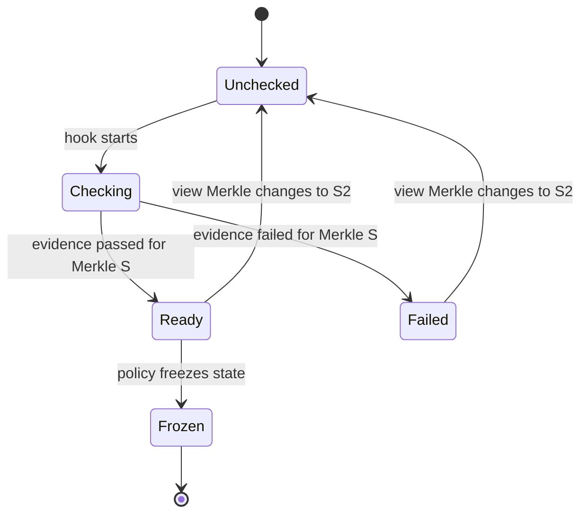
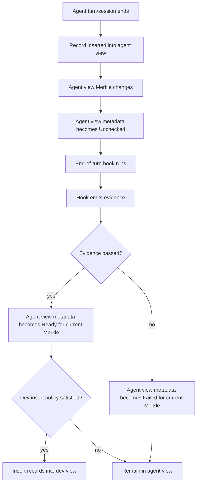
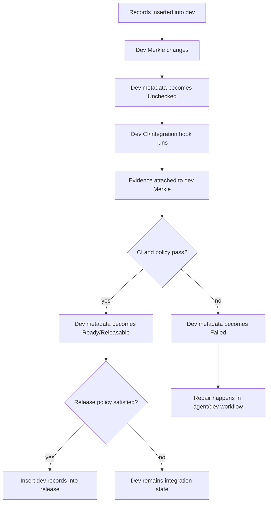
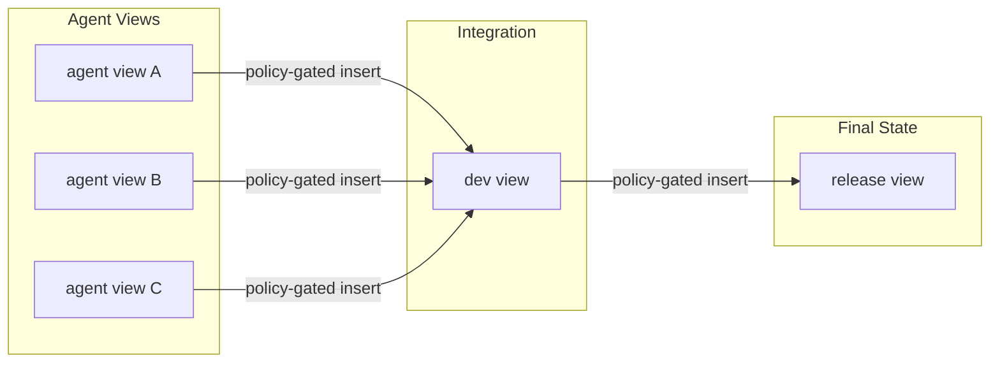
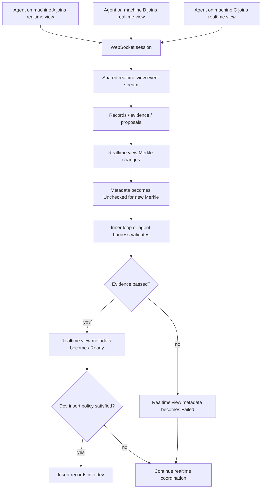
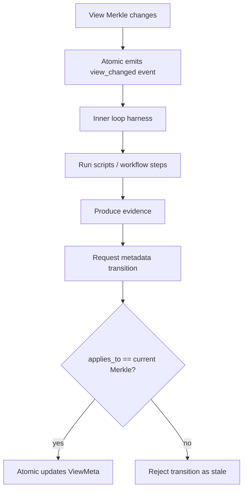
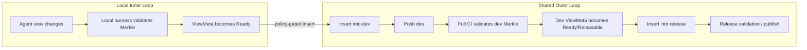

# PRD: View State Metadata and Policy-Gated Inserts

## Status

Draft for architecture discussion.

## Summary

Atomic views already provide the core isolation and composition model for agentic development: agents create records in their own views, and records can be inserted into other views without copying graph data. The missing workflow primitive is not a pull request, branch, tag, or change identity. The missing primitive is **operational metadata on views**.

This PRD proposes adding view-level metadata that describes the operational state of a view at a specific Merkle state. Hooks can observe view state changes, run external validation or automation, attach evidence, and update the view metadata. Inserts between views are then gated by policy rules that inspect the source view's effective metadata.

This model also creates room for a third collaboration mode alongside local/private and shared/integration views: a **real-time view**. Teams may have any number of shared views for integration lanes, service boundaries, release trains, staging environments, or customer-specific delivery tracks. Shared views can insert only into other shared views, while local views cannot be pushed directly. A real-time view is the best of both worlds for complex integration work: it is collaborative and cross-machine like a shared view, but lightweight and session-oriented like a local agent workspace. Multiple agents can join it over WebSockets to exchange view-state events, evidence updates, semantic context, and insertion proposals against the same Merkle-bound state without turning every speculative step into a pushed shared view or outer-loop CI run.

At a high level:

1. Records are inserted into a view.
2. The view's Merkle state changes.
3. The view metadata becomes dirty/unchecked for the new Merkle.
4. A hook runs validation, analysis, or automation.
5. The hook emits evidence and transitions the view metadata.
6. Policy rules decide whether records from that view may be inserted into another view.

This keeps `release` as a final curated state, while intermediate validation and integration happen in views such as `dev`.

## Goals

- Model workflow state at the **view** level instead of the change/tag/PR level.
- Keep `release` clean and final; use `dev` or other integration views for intermediate inserts and CI.
- Allow local agent views to become eligible for insertion into shared views only when their metadata satisfies policy.
- Allow shared views to insert into other shared views only when their metadata satisfies target policy.
- Prevent local views from being pushed directly; local records cross the collaboration boundary through policy-gated insert into an eligible shared or real-time view.
- Support `n` shared views per team rather than assuming a single `dev` and `release` pipeline.
- Support real-time collaborative views where agents across machines can coordinate over WebSockets while preserving Merkle-bound state and policy gates.
- Tie operational state to an exact Merkle state so stale validations cannot accidentally authorize new graph content.
- Let end-of-turn/session hooks produce evidence and drive view metadata transitions.
- Preserve Atomic's core model: records, views, graph state, inserts, provenance, and semantic graph intelligence.

## Non-Goals

- This is not a pull request system.
- This is not a review queue.
- This does not introduce moving tags.
- This does not require a Gerrit-style `Change-Id`.
- This does not move workflow state into the `release` view's record stream.
- This does not require a full policy engine in the first iteration.
- This does not require a full real-time replication protocol in the first iteration.
- This does not prescribe CLI command names.

## Background

Atomic currently has:

- A canonical graph containing all edges.
- Views as change-set filters over that graph.
- Agent-created views for isolated work.
- Records generated from agent turns/sessions.
- Cross-view insert operations that add record references to another view.
- Any number of team-defined shared views such as `dev`, `release`, `staging`, service integration views, customer lanes, or deployment tracks.
- Release-oriented shared views where final curated records should land.

The current primitives support the data movement, but they do not describe the operational condition of a view. For example, after an agent records changes, the system needs a way to represent:

- this view changed,
- validation is running,
- validation passed for this exact Merkle,
- validation failed for this exact Merkle,
- this view is ready to insert into `dev`,
- this `dev` state is releasable.

That state should belong to the view because CI, integration, and release readiness are properties of the integrated view state, not isolated individual records.

## View Sharing and Mobility Model

Atomic has three collaboration/mobility categories for this workflow:

| Category | Typical scope | Remote mobility | Insert rule | Purpose |
|---|---|---|---|---|
| `Local` | One machine or agent session | Cannot be pushed directly | May insert into eligible shared or real-time views by policy | Fast private work, speculative agent turns, local repair |
| `Shared` | Team-visible, durable, remotely synchronized | Can be pushed/shared | May insert only into other shared views by policy | Integration lanes, release trains, staging, customer or service views |
| `Realtime` | Multi-agent live session, possibly cross-machine | Shared over a live WebSocket session; durable push semantics are policy-defined | May receive local work and insert into shared views by policy | Complex integration work requiring multiple agents before formal shared insertion |

The important distinction is that `Shared` is not a single view named `dev`. A team can define `n` shared views and use policies to control movement between them:

```text
service-auth -> dev -> staging -> release
service-payments -> dev -> release
customer-acme -> release/acme
```

Shared-to-shared movement is the durable team workflow. Local-to-shared movement is allowed only through policy-gated insert, not push. Real-time views exist for work that is too collaborative for a single local view but too speculative or fast-moving to become a durable pushed shared view immediately.

## Core Concepts

### What Is a Merkle State?

A **Merkle state** is a compact cryptographic fingerprint of a view's current record sequence.

In Atomic, each view has an ordered list of records. As records are inserted, the view's state is updated incrementally:

```text
state_0 = Hash(empty)
state_1 = Hash(state_0 || record_hash_1)
state_2 = Hash(state_1 || record_hash_2)
state_3 = Hash(state_2 || record_hash_3)
```

The resulting Merkle value is a 32-byte hash that answers:

> "Exactly which ordered records are visible in this view right now?"

If any record changes, if a new record is inserted, if a record is removed, or if the record order changes, the Merkle state changes. This makes the Merkle state a precise identity for a view's graph state at a moment in time.

For this PRD, the important property is that validation evidence must be tied to the exact Merkle state it evaluated. If CI passed for `dev` at Merkle `S`, that does **not** mean CI passed for `dev` after another record is inserted and the view advances to Merkle `S2`.

So when this document says "metadata applies to a Merkle," it means:

> "This operational state, such as `Ready` or `Failed`, is valid only for this exact view state."

### Graph State vs Operational State

A view has graph state: its ordered record sequence and Merkle state.

A view also needs operational state: whether the current Merkle state is unchecked, validating, passed, failed, releasable, frozen, etc.

These must remain distinct.

| Concept | Meaning | Example |
|---|---|---|
| Graph state | What records are visible in the view | `Merkle(S)` after 42 records |
| Operational state | What the system knows about that graph state | `Passed`, `Failed`, `Frozen` |
| Evidence | Why the operational state is justified | CI result, test report, agent attestation |
| Policy | Rules deciding whether inserts are allowed | Agent view may insert into `dev` only when `Ready` |

### Operational State Applies to a Merkle

A view metadata state must apply to a specific Merkle state.

If a view was validated at Merkle `S`, and then a new record is inserted producing Merkle `S2`, the previous validation is stale. The view may still store the prior evidence, but its effective state for current insert policy evaluation is dirty/unchecked.



### View Roles

The existing `ViewScope` describes lifecycle/deletion semantics such as `Draft` vs `Shared`. This PRD proposes adding an independent role dimension for operational semantics. Sharing/mobility is still a separate policy axis: local views cannot be pushed directly, shared views can be pushed, and real-time views use WebSocket session sharing before any durable insertion into shared views.

Possible roles:

- `Agent`: records are born here from agent turns/sessions.
- `Dev`: integrated state from multiple views; CI and repair happen here.
- `Release`: final curated state.
- `Production`: optional deployment-facing state.
- `Realtime`: low-latency collaborative state shared by multiple agents over a live session.
- `Experiment`: optional unmanaged or manually governed view.

Roles are not branches. Roles define policy expectations and hook behavior. Sharing semantics are governed by the view's mobility category and insert policy.

### View Lifecycle State

A small state vocabulary is enough for the first iteration.

Suggested initial lifecycle states:

- `Unchecked`: view changed and has not been evaluated.
- `Checking`: hook/CI/policy evaluation is running.
- `Ready`: source view is eligible for insertion into its target under policy.
- `Failed`: validation failed for the current Merkle.
- `Quarantined`: view is explicitly blocked regardless of current evidence.
- `Frozen`: view should not be mutated except by explicit override.
- `Published`: final state has been externally published/deployed/released.

This vocabulary can be revised. The important invariant is that lifecycle state is view-level and Merkle-bound.

## Proposed Data Model

### View Metadata

Conceptual structure:

```rust
pub struct ViewMeta {
    pub view_id: u64,
    pub role: ViewRole,
    pub lifecycle_state: ViewLifecycleState,
    pub applies_to: Merkle,
    pub policy: Option<PolicyRef>,
    pub last_checked_state: Option<Merkle>,
    pub last_ready_state: Option<Merkle>,
    pub last_failed_state: Option<Merkle>,
    pub updated_at: i64,
}
```

`applies_to` is critical. It says the lifecycle state is only valid for that exact Merkle.

### Evidence

Evidence should attach to a view state, not to a PR-like object.

Conceptual structure:

```rust
pub struct ViewEvidence {
    pub id: EvidenceId,
    pub view_id: u64,
    pub merkle: Merkle,
    pub kind: EvidenceKind,
    pub status: EvidenceStatus,
    pub producer: EvidenceProducer,
    pub command: Option<String>,
    pub exit_code: Option<i32>,
    pub artifact_hash: Option<Hash>,
    pub created_at: i64,
}
```

Initial evidence can be lightweight database metadata. Later, evidence can be backed by content-addressed attestation/provenance nodes.

### Policy

Policies gate insert operations between views.

Conceptual structure:

```rust
pub struct InsertPolicy {
    pub source_role: ViewRole,
    pub target_role: ViewRole,
    pub required_source_state: ViewLifecycleState,
    pub required_evidence: Vec<EvidenceRequirement>,
    pub allow_stale_evidence: bool,
    pub conflict_policy: ConflictPolicy,
    pub dependency_policy: DependencyPolicy,
}
```

Policies should evaluate **effective state**, not raw metadata.

### Real-Time View Session Metadata

A real-time view is still an Atomic view. Its records, graph visibility, Merkle state, evidence, and insert eligibility follow the same rules as any other view. The real-time behavior is session metadata layered on top of the view.

A real-time view should be treated as the integration workspace for work that is too complex for isolated local views but not yet appropriate for durable shared-view publication. Local views can contribute by policy-gated insert into the real-time view; the real-time view can later insert into an eligible shared view once its current Merkle has the required state and evidence.

Conceptual structure:

```rust
pub struct RealtimeViewSession {
    pub view_id: u64,
    pub session_id: SessionId,
    pub coordinator: Option<IdentityId>,
    pub transport: RealtimeTransport,
    pub current_merkle: Merkle,
    pub participant_count: u32,
    pub last_event_seq: u64,
    pub opened_at: i64,
    pub updated_at: i64,
}

pub struct RealtimeParticipant {
    pub session_id: SessionId,
    pub identity: IdentityId,
    pub agent_id: Option<AgentId>,
    pub machine_id: Option<MachineId>,
    pub last_seen_event_seq: u64,
    pub joined_at: i64,
    pub last_seen_at: i64,
}
```

Initial transport can be WebSocket-based, but the database should model the collaboration state independently from the transport so future transports can be added.

Real-time session metadata should not replace `ViewMeta`. Instead:

- `ViewMeta` answers: "What is the operational status of this Merkle?"
- `ViewEvidence` answers: "Why is that status justified?"
- `RealtimeViewSession` answers: "Who is currently coordinating around this view state, and what event stream have they observed?"

## Effective View State

The system should derive an effective operational state before policy evaluation.

Pseudo-logic:

```text
effective_state(view):
  if view.meta.applies_to != view.current_merkle:
      return Unchecked
  if view.meta.lifecycle_state == Quarantined:
      return Quarantined
  if required evidence is missing or stale:
      return Unchecked
  return view.meta.lifecycle_state
```

This prevents stale validation from authorizing new content.

## System Flow

### Agent View to Dev View



### Dev View to Release View



### Full View Pipeline



### Real-Time Agent Collaboration View

A real-time view is useful when multiple agents need to coordinate on the same problem before records enter a durable shared view. For example, one agent may edit implementation code, another may update tests, another may run semantic analysis, and another may repair failures. They can all subscribe to the same view-state event stream and make decisions against the same Merkle-bound operational metadata.



Key properties:

- The real-time view is a view, not a chat room. Its authoritative state is still the Atomic graph and view Merkle.
- The WebSocket session distributes events; it does not replace records, evidence, or policy evaluation.
- Every event that claims a lifecycle transition or evidence result must name the Merkle it applies to.
- Participants may be local agents, remote agents, humans, or automation harnesses, but each should be represented by identity/provenance metadata.
- Inserts from a real-time view into a shared view should be policy-gated exactly like inserts from any other source role.
- Real-time views provide collaboration without requiring every intermediate state to become a pushed shared view.

## Hook Model

Hooks observe view transitions and produce evidence.

A hook should receive enough context to reason about the state transition:

```json
{
  "event": "view_changed",
  "view_id": 12,
  "view_name": "agent-ses-abc",
  "role": "Agent",
  "previous_merkle": "...",
  "current_merkle": "...",
  "previous_change_count": 4,
  "current_change_count": 5,
  "inserted_records": ["..."],
  "parent_view": "dev",
  "actor": "agent/session identifier"
}
```

The hook can be implemented as a shell script or external command in the first iteration. It returns structured evidence and a requested lifecycle transition.

Example conceptual hook output:

```json
{
  "state": "Ready",
  "applies_to": "current_merkle",
  "evidence": [
    {
      "kind": "basic-validation",
      "status": "passed",
      "command": "cargo test -p atomic-core",
      "exit_code": 0,
      "artifact": null
    }
  ]
}
```

Atomic should validate that `applies_to` matches the current Merkle before accepting the transition.

## Inner Loop Harness

The hook model creates room for a local **inner loop**: a repeatable agent/runtime harness that runs near the working copy, evaluates the changed view state, and emits metadata/evidence back to Atomic.

The inner loop is intentionally local-first. It can be as simple as a shell script, or as structured as a workflow runner such as `circuit-breaker`. The important architectural point is that the inner loop is not the source of truth. Atomic remains the source of truth for:

- the view's Merkle state,
- the records visible in the view,
- the operational metadata for that Merkle,
- evidence associated with that Merkle,
- policy decisions for inserts.

The inner loop is an execution mechanism that answers:

> "Given this exact view state, what evidence can we produce, and what lifecycle transition should be requested?"

### Inner Loop Responsibilities

An inner loop harness can run any combination of local or remote steps:

- format checks,
- unit tests,
- integration tests,
- semantic diff inspection,
- dependency analysis,
- security checks,
- generated-code verification,
- provenance summarization,
- code intelligence enrichment,
- agent self-checks or repair attempts.

It receives the `view_changed` event, runs its pipeline, and returns evidence plus a requested lifecycle state. Atomic then verifies that the evidence applies to the current Merkle before updating view metadata.



### Circuit Breaker as a Candidate Harness

`circuit-breaker` is a natural fit for this role because it models local and remote automation as explicit workflow transitions. Atomic does not need to know the internal workflow graph. It only needs a stable contract:

1. Atomic emits a view-state event.
2. The harness runs a pipeline against that exact view state.
3. The harness returns structured evidence.
4. Atomic records the evidence and updates metadata if the Merkle still matches.

This allows teams to evolve validation logic without baking every check into Atomic core. A simple repository might use a shell script. A larger repository might use a `circuit-breaker` pipeline that fans out tests, runs agent analysis, collects artifacts, and emits a single view-state result.

### Inner Loop vs CI

The inner loop is not a replacement for CI. It is the first local feedback layer for view metadata.

| Layer | Runs Where | Purpose | Output |
|---|---|---|---|
| Inner loop | Local machine, agent harness, or nearby runner | Fast validation and enrichment after a view changes | Evidence for agent/dev insertion policy |
| Dev CI | Integration environment | Validate combined records inserted into `dev` | Evidence for dev lifecycle state |
| Release validation | Release/deployment environment | Validate final releasable state | Evidence for release/freeze/publish policy |

This gives agents useful feedback before records enter `dev`, while still preserving integrated CI on the `dev` view before anything reaches `release`.

### Inner Loop Contract

The contract should stay small:

```text
input:
  view_id
  view_name
  role
  previous_merkle
  current_merkle
  inserted_records
  parent_view
  actor/session

output:
  applies_to: current_merkle
  requested_state: Ready | Failed | Checking | Quarantined
  evidence[]
  optional artifacts
```

This keeps the harness replaceable. Atomic cares about evidence and metadata transitions, not about whether the checks were implemented with shell scripts, `circuit-breaker`, Dagger, a local agent process, or a remote CI service.

## Inner Loop vs Outer Loop: Remote CI Boundary

A major motivation for this model is the scaling failure of remote branch-centric CI in agentic development.

In a GitHub-style workflow, high-volume agent work tends to create high-volume remote branches. Each branch often triggers remote validation through GitHub Actions or another CI system. This creates a poor scaling profile when agents generate many speculative states:

- too many remote branches,
- too many remote workflow runs,
- too much duplicated CI,
- too much queue time,
- too much branch cleanup,
- too much remote state for work that may never be integrated.

Atomic can draw a different boundary.

Local agent views are high-churn execution contexts. They should usually be validated by the **inner loop** first: local scripts, local harnesses, targeted tests, semantic checks, provenance checks, or an agent runtime such as `circuit-breaker`. Local views cannot be pushed directly. Only after a local view reaches a policy-approved metadata state should its records be eligible for insertion into a shared or real-time view.

The **outer loop** should validate shared integrated states, not every speculative agent state. In practice, that means full integration suites such as Jenkins, CircleCI, Bazel remote execution, or heavyweight cloud CI should run when team-defined shared views such as `dev`, `staging`, `release`, service integration views, or customer lanes change. Shared views can insert only into other shared views, so durable remote workflow remains explicit and policy-controlled.



### Validation Boundary by View Role

| View role | Typical churn | Validation layer | Remote publication |
|---|---:|---|---|
| `Agent` | Very high | Inner loop: local harness, targeted tests, semantic/provenance checks | Usually local/private |
| `Realtime` | High | Shared inner loop: live agent coordination, targeted checks, evidence exchange | Shared over WebSocket; inserted into shared views only when policy-ready |
| `Dev` | Medium | Outer loop: full integration CI over combined records | Pushed/shared; inserts only to shared views |
| `Release` | Low | Release validation, signing, deployment checks | Pushed/shared/final |

This suggests three important operational rules:

> Local views cannot be pushed directly.
>
> Shared views can insert only into other shared views.
>
> Real-time views are the collaborative middle ground for complex integration work: cross-machine and multi-agent, but not equivalent to a durable pushed shared view.

Agent views may remain local, private, and ephemeral. Their records only cross the shared boundary when their view metadata satisfies insert policy. Teams may have any number of shared views, and policies decide which shared-to-shared paths are allowed. This gives Atomic a scaling advantage for agentic development: agents can generate many local and real-time view states without forcing every state through remote CI.

### Local UI Requirement

If the inner loop replaces the remote PR page for early validation, Atomic needs a local UI that makes view state understandable.

The UI should represent the current view as a state machine, not as a branch review. For an agent view, it should show:

- current Merkle,
- parent/target view,
- lifecycle state for the current Merkle,
- inner-loop steps and evidence,
- policy eligibility for insertion into `dev`,
- semantic diff summary,
- affected code graph entities,
- provenance and attestation summary.

For `dev`, it should show:

- current Merkle,
- last known ready/green Merkle,
- records inserted since that state,
- full CI evidence,
- release eligibility,
- failed evidence or missing policy requirements.

This local UI becomes the agentic equivalent of a workflow dashboard, but it is view-state-native rather than PR-native.

### Remote CI Trigger Model

The recommended trigger model is:

```text
local view changes locally
  -> inner loop validates local view Merkle
  -> source view metadata becomes Ready
  -> policy allows insert into realtime or shared integration view
  -> realtime view may coordinate additional agents over WebSocket
  -> policy allows insert into shared view
  -> shared view Merkle changes
  -> shared view is pushed/shared
  -> full external CI validates shared Merkle
  -> shared view metadata becomes Ready/Releasable
  -> policy allows insert into the next shared view
```

Under this model, expensive external CI runs on durable shared integration views, not on every speculative local or real-time agent state. Release validation runs only after an upstream shared view has produced an eligible state.

## Policy-Gated Inserts

An insert from source view to target view should evaluate policy before modifying the target view.

Baseline movement rules:

- `Local` views cannot be pushed directly.
- `Local` views may insert into eligible real-time or shared views when source policy is satisfied.
- `Realtime` views may insert into eligible shared views when source policy is satisfied.
- `Shared` views may insert only into other shared views when source and target policy are satisfied.
- Shared-to-shared policies are team-defined, so there may be many valid shared pipelines rather than one hard-coded `dev -> release` path.

Conceptual logic:

```text
can_insert(source, target):
  policy = resolve_policy(source.role, target.role, target.policy)
  source_effective_state = effective_state(source)

  if source_effective_state != policy.required_source_state:
      deny

  if policy.required_evidence not satisfied for source.current_merkle:
      deny

  if dependency/conflict policy fails:
      deny

  allow
```

For example:

### Agent -> Dev Policy

```text
source role: Agent
target role: Dev
required source state: Ready
required evidence:
  - turn-complete
  - basic-validation
requirements:
  - source metadata applies to source current Merkle
  - agent identity/delegation is valid
  - dependencies can be inserted
```

### Realtime -> Shared Policy

```text
source role: Realtime
target role: Shared integration role, such as Dev / Staging / Release-candidate
required source state: Ready
required evidence:
  - realtime-session-closed or coordinator-approved
  - participant-provenance-complete
  - basic-validation
requirements:
  - source metadata applies to source current Merkle
  - every inserted record has valid identity/provenance
  - session event stream is complete through source current Merkle
  - dependencies can be inserted
```

A real-time view may allow multiple agents to produce records and evidence concurrently, but insert policy should evaluate the final source Merkle, not individual socket events.

### Shared -> Shared Policy

```text
source role: Dev, Staging, Release-candidate, or another shared role
target role: Release, Production, customer lane, or another shared role
required source state: Ready or Releasable
required evidence:
  - integration-ci-passed
  - policy-check-passed
requirements:
  - source metadata applies to source current Merkle
  - source is not quarantined
  - release is not frozen unless override is present
```

## Release View Semantics

`release` should represent final curated state. Intermediate statuses such as blocked, admissible, or invalid should not be stored as release-view workflow state for external agent records.

Instead:

- agent views carry their own validation metadata,
- dev/integration views carry integration metadata,
- release receives records only from views that satisfy release policy,
- release may then transition to frozen/published/deployed states based on its own role.

This keeps `release` simple and prevents it from becoming a review queue.

## Why This Is Atomic-Native

This model uses Atomic's existing strengths instead of recreating GitHub/Gerrit concepts:

- Views are the operational containers.
- Records remain immutable graph facts.
- Inserts remain the mechanism for making records visible in another view.
- View Merkle states become the units of validation.
- Hooks produce evidence about exact view states.
- Policies gate graph visibility transitions.
- Agents get code intelligence at the point where it matters: the view state transition they are working on.

The system does not need pull requests, moving tags, branch review queues, or change IDs to coordinate work.

## Agentic Code Intelligence Opportunity

Because Atomic has a change graph, semantic graph, and provenance graph, hooks and repair agents can receive far richer context than a Git diff:

- records inserted since the last ready/green dev state,
- semantic entities touched by those records,
- token-level blame and authorship,
- agent/session provenance,
- test evidence tied to exact Merkle states,
- dependency closure,
- view-aware code search and graph traversal,
- prior reasoning attached to agent records.

This enables a workflow where agents do not merely respond to failing PR checks. They operate on exact graph state transitions with semantic and provenance context.

## Implementation Notes

*Added May 6, 2026 — Aaron Ogle, Bradley Hilton*

The following clarifies mechanics that came out of the first design review pass. These are refinements to the model above, not changes to it.

### Hook Delivery

The `view_changed` hook fires **asynchronously** after the insert commits and returns to the caller. The insert itself should not block on hook delivery. This matters for the outer loop: CI can take minutes; the insert should not.

Hooks fire only for **Shared** views. Local view state changes are high-churn and should not produce server-side events — that is precisely the GitHub problem we are avoiding.

Hook registration is per-project, stored in the database. Conceptually (CLI names TBD):

```bash
atomic hooks add \
  --event view_changed \
  --url https://cb.internal/webhooks/atomic \
  --roles Shared
```

There is no separate webhook secret to manage. Authentication works in two directions using Ed25519, and it is important to understand each direction separately.

**Direction 1 — atomic-storage → CB (the webhook)**

When atomic-storage sends a `view_changed` payload to CB, CB needs to verify the payload is genuine and not spoofed. atomic-storage signs the payload with **its own private key**. CB verifies that signature using **atomic-storage's public key**. CB receives atomic-storage's public key once at CI runner registration time (see below). After that, every incoming webhook can be verified without any shared secret.

**Direction 2 — CB → atomic-storage (evidence submission)**

When CB POSTs evidence back, atomic-storage needs to verify the request is coming from the authorized runner for that project — not an arbitrary client. CB registers its own Ed25519 keypair as a **CI runner identity** on the project (see CI Runner Identity below). CB presents its public key as its identity on every request. atomic-storage looks it up, finds the registered CI runner, and checks it has permission to submit evidence for that project. This is the same mechanism used for all identities in atomic-storage today.

The payload is structured as follows:

```json
{
  "event": "view_changed",
  "workspace": "acme",
  "project": "api",
  "view": {
    "id": 12,
    "name": "dev",
    "role": "Shared",
    "merkle_before": "aaa...",
    "merkle_after": "bbb...",
    "inserted_change_hashes": ["c1hash", "c2hash"]
  },
  "timestamp": "2026-05-06T11:37:00Z",
  "signature": "ed25519:..."
}
```

### Inner Loop Evidence Is Change-Hash-Bound, Not Merkle-Bound

The PRD describes hooks emitting evidence with `applies_to: current_merkle`. This is correct for the **outer loop** (CI running against an integrated Shared view). It is not correct for the **inner loop**.

Local views do not exist on the server. There is no server-side Merkle state for a local view, so inner loop evidence cannot be Merkle-bound. Instead, inner loop evidence is bound to the **change hashes** being inserted — the Blake3 content addresses of the records themselves. Change hashes are immutable and identical locally and on the server, so this evidence travels with the records regardless of which view they end up in.

| | Inner loop | Outer loop |
|---|---|---|
| Runs where | Agent machine, locally | CI server / CB runner |
| Triggered by | End of agent turn (local hook) | `view_changed` webhook on Shared view |
| Evidence bound to | **Change hashes** | **View Merkle** |
| Stale risk | None — hashes are content addresses | High — Merkle advances on every insert |
| Evidence submitted | Before `atomic insert` | After receiving `view_changed` webhook |

When the agent runs `atomic insert --to dev`, the request carries inner loop evidence inline, keyed to the change hashes being inserted. The server checks that those change hashes have the required inner loop evidence before writing anything to `dev`. No server-side agent view is created or persisted.

### The Stale Evidence Guarantee

The `applies_to` check is what makes Merkle-bound evidence safe. The concrete scenario:

```
T=0  Insert lands in dev → Merkle = bbb... → view_changed fires → outer loop CI starts
T=1  Another insert lands → dev Merkle = ccc... → ViewMeta for ccc... = Unchecked
T=2  CI from T=0 finishes → POST evidence: applies_to = bbb...
     Server: bbb... ≠ ccc... → 409 Stale, rejected
     ViewMeta for ccc... stays Unchecked
     New view_changed already fired at T=1 → fresh CI run underway for ccc...
```

The evidence from the first run is stored historically but cannot advance the view state for `ccc...`. A Shared view cannot be promoted to the next view until CI completes against its **current** Merkle.

### Evidence Submission Endpoint

CI (or any authorized runner) submits evidence via:

```
POST /workspaces/{ws}/projects/{p}/views/{view}/evidence
Authorization: Bearer <ci_runner_identity>

{
  "applies_to": "bbb...",          ← Merkle (outer loop); omit for inner loop
  "change_hashes": null,           ← change hashes (inner loop); omit for outer loop
  "requested_state": "Ready",
  "evidence": [
    {
      "kind": "integration-ci",
      "status": "passed",
      "runner": "circuit-breaker",
      "workflow": "dev-validation",
      "duration_ms": 45000,
      "exit_code": 0
    }
  ]
}
```

Server validation:
1. If `applies_to` is present: check it equals `view.current_merkle`. If not, return 409.
2. Check the evidence kinds satisfy the view's policy requirements.
3. Write to `view_evidence` table (stale evidence is stored historically, not discarded).
4. Update `view_meta`: `state = requested_state, applies_to = bbb...`.

### CI Runner Identity

A CI runner (Circuit Breaker or any other system) must be registered with atomic-storage before it can submit evidence or pull project code. Registration produces two things:

1. **A CI runner keypair** — an Ed25519 keypair generated for the runner. The public key is registered with atomic-storage as a project collaborator with `ci-runner` role. The private key is held by the runner and used to sign outgoing requests to atomic-storage.

2. **atomic-storage's public key** — returned as part of the registration response. The runner stores this and uses it to verify the `signature` field on every incoming `view_changed` webhook.

Conceptually (CLI names TBD):

```bash
atomic identity new --role ci-runner --project api
# → generates Ed25519 keypair for the runner
# → registers the runner's public key with atomic-storage (role: ci-runner)
# → returns atomic-storage's public key for the runner to store
# → outputs the runner's private key to configure in CB
```

After this, the two directions are fully covered:
- **Incoming webhooks**: runner verifies payload signature using atomic-storage's public key
- **Outgoing evidence**: runner presents its own public key as `Authorization: Bearer <ci_runner_pubkey>`; atomic-storage checks it matches the registered CI runner for the project

The `ci-runner` role grants read access to the project (so CB can pull code and workflow definitions at a given Merkle) and permission to POST to the evidence endpoint. It cannot write records, create views, or modify project settings.

### Where Workflow Definitions Live

Circuit Breaker currently has no tenant concept — workflows are registered globally. In a multi-project, multi-tenant world this does not scale. The right answer is: **workflow definitions live in the atomic project repo**, checked in alongside the code.

When CB receives a `view_changed` webhook, it:

1. Uses the project's CI runner identity to authenticate to atomic-storage.
2. Pulls the project at `merkle_after` — the exact state that was just inserted.
3. Reads `.cb/config.toml` from the checkout to find which workflow to run for this view.
4. Executes the workflow from the versioned definition.
5. Posts evidence back via the evidence endpoint.

```toml
# .cb/config.toml — checked into the project repo
[routing]
[routing.dev]
workflow = ".cb/workflows/dev-validation.ts"

[routing.release]
workflow = ".cb/workflows/release-validation.ts"
```

This means the workflow that validated a given Merkle is the one that existed at that Merkle — there is no version skew between the code being validated and the validation rules. It also means tenant isolation falls out naturally: CB is pulling from `acme.atomic.storage` with acme's CI runner credentials, never touching another tenant's data.

### CLI: `atomic push` Becomes `atomic insert`

`atomic push` as currently implemented — push a local view to a matching remote view — does not fit this model. Local views cannot persist on the server.

The replacement for the local→shared case is `atomic insert --to dev`. The CLI collects inner loop evidence from the last harness run, attaches it to the request, and the server evaluates the policy and applies the insert atomically. If no inner loop evidence is present, the insert fails with a clear error.

For shared-to-shared promotion:

```bash
atomic insert dev release   # explicit; policy-evaluated server-side
```

Promotion can also be configured to happen automatically when a Shared view reaches `Ready`:

```toml
[policies.dev_to_release]
source_role      = "Shared"
target_role      = "Release"
required_evidence = ["integration-ci", "human-approval"]
auto_insert      = true
```

### Human Approval as Evidence

Human approval is modeled as an evidence kind, not a special gate. A Circuit Breaker workflow pauses at an approve transition, a human approves in the CB UI or via CLI token injection, and CB posts `human-approval` evidence to the evidence endpoint. The policy for `dev → release` lists `human-approval` as a required evidence kind alongside `integration-ci`. Both must be present for the effective state to be `Ready`.

This keeps the policy model uniform — there is no special approval path, just another evidence kind that a workflow produces.

---

## Open Questions

1. Should `ViewMeta` live inside serialized `ViewState`, or in a separate `VIEW_META` table for compatibility?
2. What is the minimal lifecycle state vocabulary for the first implementation?
3. ~~Should policies be stored as repository config, database rows, or both?~~ **Resolved**: Database rows, configured via CLI (`atomic policy set`). This keeps policies server-authoritative and avoids a bootstrapping problem where the policy file must be readable before the policy is enforced.
4. ~~What evidence kinds are required for agent-to-dev insertion in the first version?~~ **Resolved**: `inner-loop` (passed for all change hashes being inserted). Submitted inline with the insert request, keyed to change hashes not Merkle.
5. ~~What evidence kinds are required for dev-to-release insertion?~~ **Resolved**: `integration-ci` (required); `human-approval` (optional, configurable per-project policy). Both are Merkle-bound evidence kinds submitted via the evidence endpoint after the outer loop CI run.
6. ~~Should hooks be synchronous with insert/record, or asynchronous with later metadata updates?~~ **Resolved**: Asynchronous. The insert commits and returns to the caller before the hook fires. Hooks are fire-and-forget from the insert's perspective; reliability is the receiver's responsibility (CB should be idempotent on redelivery).
7. Should failed hook execution transition a view to `Failed` or leave it `Unchecked` with failed evidence?
8. How should manual override evidence be represented?
9. Should release insertion be blocked when release is `Frozen`, or allowed with explicit override evidence?
10. How should remote sync treat view metadata and evidence?
11. ~~How should teams configure allowed shared-to-shared insertion paths when they have `n` shared views?~~ **Resolved**: Policy rows keyed by `(project_id, source_role, target_role)`. Teams add as many rows as they need. Named shared views (e.g., `staging`, `release/acme`) are just views with `Shared` mobility and a configured policy path.
12. Should real-time view sessions be ephemeral transport sessions, durable view metadata, or both?
13. What is the minimum WebSocket event vocabulary for real-time views: join, leave, view_changed, evidence_added, state_transition_requested, insert_proposed, insert_completed?
14. How should concurrent agents coordinate write authority inside a real-time view: optimistic record insertion, coordinator election, leases, or explicit turn-taking?
15. Should real-time views have their own role (`Realtime`) or be a collaboration mode on top of `Agent`/`Dev` roles?
16. How should reconnect/resume work when an agent misses WebSocket events but the view Merkle has advanced?

## Suggested Initial Implementation Slice

1. Add `ViewRole` and `ViewLifecycleState` concepts.
2. Store `ViewMeta` separately from existing `ViewState` to minimize compatibility risk.
3. On record/insert into a view, mark metadata `Unchecked` for the new Merkle.
4. Add a hook event for `view_changed` that receives previous/current Merkle and change count.
5. Store lightweight `ViewEvidence` records keyed by `(view_id, merkle)`.
6. Implement an effective-state check that treats stale metadata as `Unchecked`.
7. Gate cross-view insert with simple source/target role policy.
8. Enforce that local views cannot be pushed directly.
9. Enforce that shared views can insert only into other shared views.
10. Allow team configuration for `n` shared views and their permitted shared-to-shared insertion paths.
11. Define `Realtime` as either an initial role or reserved role, but defer full transport implementation unless needed for the first release.
12. Start with two policies:
   - Local Agent -> Shared requires `Ready`.
   - Shared -> Shared requires `Ready` or `Releasable`, depending on the target role.
13. Optionally add a preview policy:
   - Realtime -> Shared requires `Ready` plus complete participant provenance.

## Success Criteria

- A view's operational metadata is invalidated when its Merkle changes.
- Hooks can transition metadata for the exact Merkle they evaluated.
- Inserts from agent views into dev can be blocked until the source view is `Ready`.
- Inserts from dev into release can be blocked until dev satisfies release policy.
- Release remains free of intermediate workflow status for agent records.
- The model supports CI on integrated dev state before final release insertion.
- The model can represent a real-time collaborative agent view without weakening Merkle-bound evidence or policy-gated inserts.
