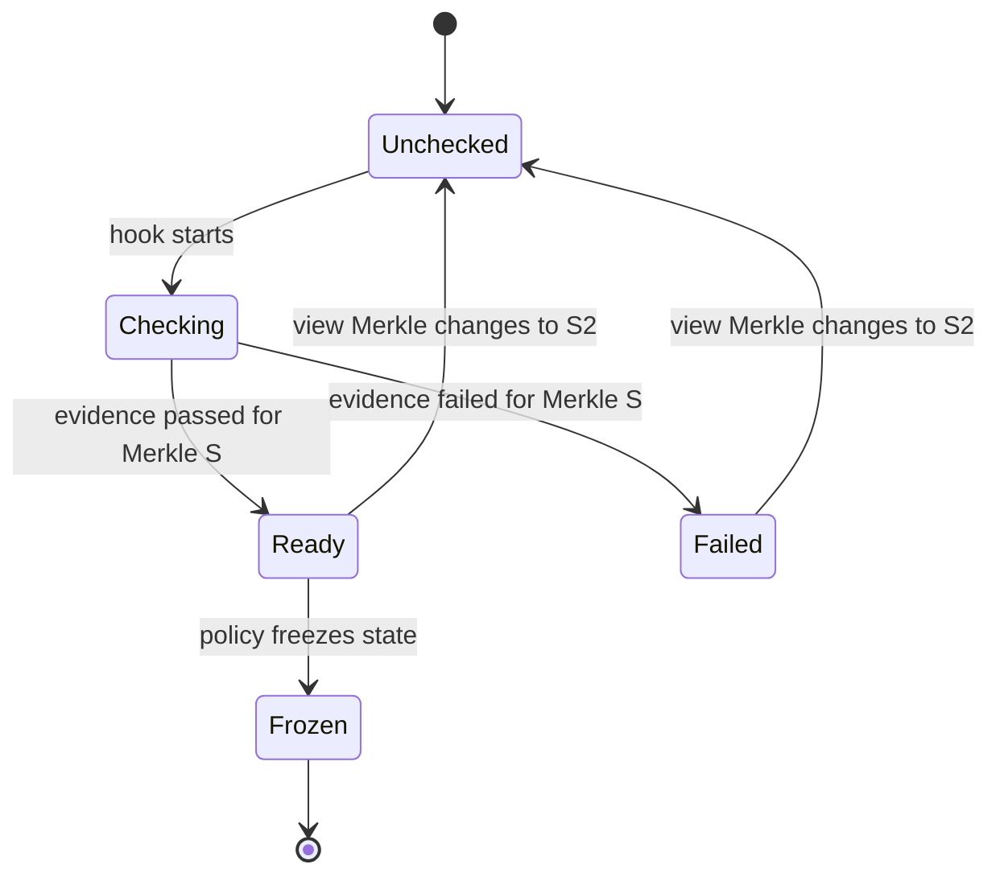
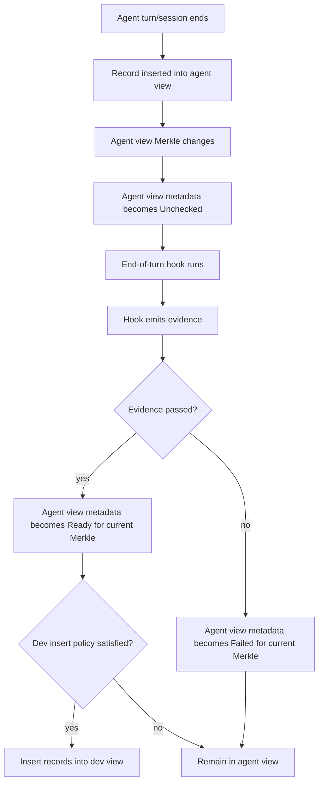
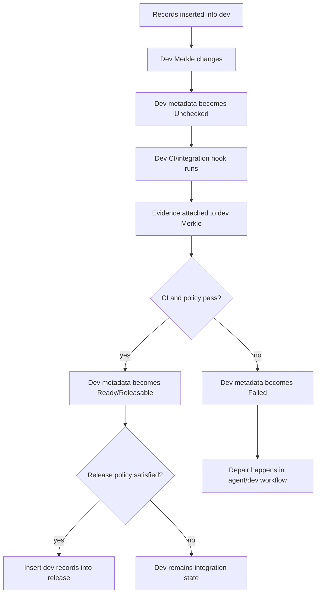
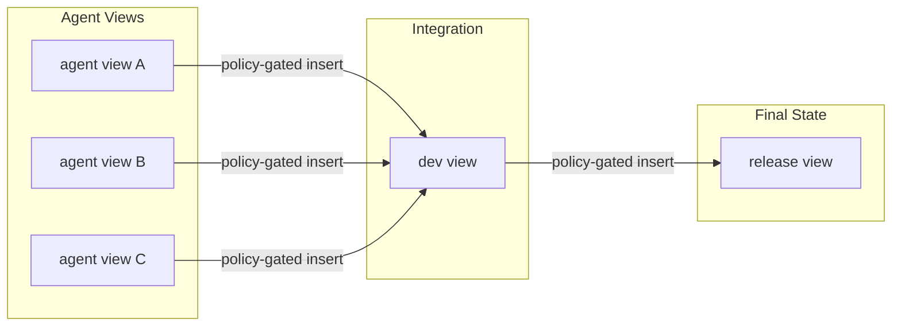
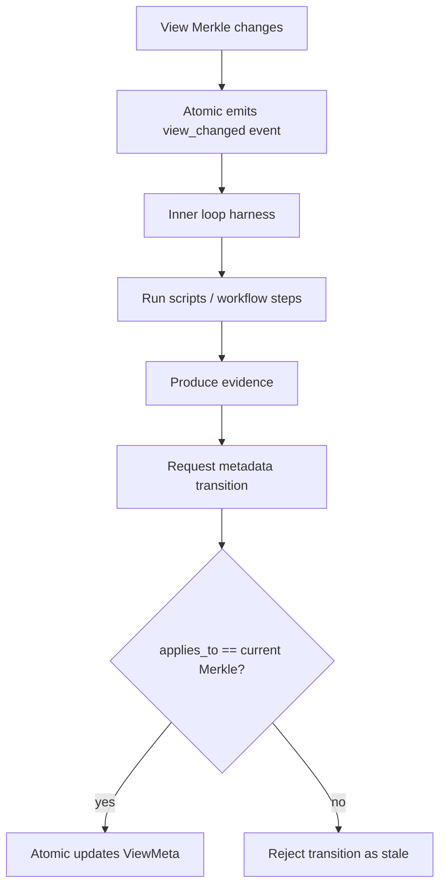
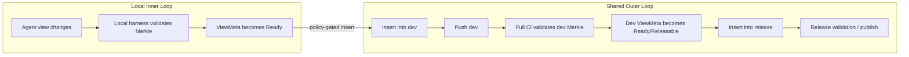

# PRD: View State Metadata and Policy-Gated Inserts

## Status

Draft for architecture discussion.

## Summary

Atomic views already provide the core isolation and composition model for agentic development: agents create records in their own views, and records can be inserted into other views without copying graph data. The missing workflow primitive is not a pull request, branch, tag, or change identity. The missing primitive is **operational metadata on views**.

This PRD proposes adding view-level metadata that describes the operational state of a view at a specific Merkle state. Hooks can observe view state changes, run external validation or automation, attach evidence, and update the view metadata. Inserts between views are then gated by policy rules that inspect the source view's effective metadata.

At a high level:

1. Records are inserted into a view.
2. The view's Merkle state changes.
3. The view metadata becomes dirty/unchecked for the new Merkle.
4. A hook runs validation, analysis, or automation.
5. The hook emits evidence and transitions the view metadata.
6. Policy rules decide whether records from that view may be inserted into another view.

This keeps `release` as a final curated state, while intermediate validation and integration happen in views such as `dev`.

## Goals

- Model workflow state at the **view** level instead of the change/tag/PR level.
- Keep `release` clean and final; use `dev` or other integration views for intermediate inserts and CI.
- Allow agent views to become eligible for insertion into `dev` only when their metadata satisfies policy.
- Allow `dev` to become eligible for insertion into `release` only when its metadata satisfies release policy.
- Tie operational state to an exact Merkle state so stale validations cannot accidentally authorize new graph content.
- Let end-of-turn/session hooks produce evidence and drive view metadata transitions.
- Preserve Atomic's core model: records, views, graph state, inserts, provenance, and semantic graph intelligence.

## Non-Goals

- This is not a pull request system.
- This is not a review queue.
- This does not introduce moving tags.
- This does not require a Gerrit-style `Change-Id`.
- This does not move workflow state into the `release` view's record stream.
- This does not require a full policy engine in the first iteration.
- This does not prescribe CLI command names.

## Background

Atomic currently has:

- A canonical graph containing all edges.
- Views as change-set filters over that graph.
- Agent-created views for isolated work.
- Records generated from agent turns/sessions.
- Cross-view insert operations that add record references to another view.
- Release-oriented shared views where final curated records should land.

The current primitives support the data movement, but they do not describe the operational condition of a view. For example, after an agent records changes, the system needs a way to represent:

- this view changed,
- validation is running,
- validation passed for this exact Merkle,
- validation failed for this exact Merkle,
- this view is ready to insert into `dev`,
- this `dev` state is releasable.

That state should belong to the view because CI, integration, and release readiness are properties of the integrated view state, not isolated individual records.

## Core Concepts

### What Is a Merkle State?

A **Merkle state** is a compact cryptographic fingerprint of a view's current record sequence.

In Atomic, each view has an ordered list of records. As records are inserted, the view's state is updated incrementally:

```text
state_0 = Hash(empty)
state_1 = Hash(state_0 || record_hash_1)
state_2 = Hash(state_1 || record_hash_2)
state_3 = Hash(state_2 || record_hash_3)
```

The resulting Merkle value is a 32-byte hash that answers:

> "Exactly which ordered records are visible in this view right now?"

If any record changes, if a new record is inserted, if a record is removed, or if the record order changes, the Merkle state changes. This makes the Merkle state a precise identity for a view's graph state at a moment in time.

For this PRD, the important property is that validation evidence must be tied to the exact Merkle state it evaluated. If CI passed for `dev` at Merkle `S`, that does **not** mean CI passed for `dev` after another record is inserted and the view advances to Merkle `S2`.

So when this document says "metadata applies to a Merkle," it means:

> "This operational state, such as `Ready` or `Failed`, is valid only for this exact view state."

### Graph State vs Operational State

A view has graph state: its ordered record sequence and Merkle state.

A view also needs operational state: whether the current Merkle state is unchecked, validating, passed, failed, releasable, frozen, etc.

These must remain distinct.

| Concept | Meaning | Example |
|---|---|---|
| Graph state | What records are visible in the view | `Merkle(S)` after 42 records |
| Operational state | What the system knows about that graph state | `Passed`, `Failed`, `Frozen` |
| Evidence | Why the operational state is justified | CI result, test report, agent attestation |
| Policy | Rules deciding whether inserts are allowed | Agent view may insert into `dev` only when `Ready` |

### Operational State Applies to a Merkle

A view metadata state must apply to a specific Merkle state.

If a view was validated at Merkle `S`, and then a new record is inserted producing Merkle `S2`, the previous validation is stale. The view may still store the prior evidence, but its effective state for current insert policy evaluation is dirty/unchecked.



### View Roles

The existing `ViewScope` describes lifecycle/deletion semantics such as `Draft` vs `Shared`. This PRD proposes adding an independent role dimension for operational semantics.

Possible roles:

- `Agent`: records are born here from agent turns/sessions.
- `Dev`: integrated state from multiple views; CI and repair happen here.
- `Release`: final curated state.
- `Production`: optional deployment-facing state.
- `Experiment`: optional unmanaged or manually governed view.

Roles are not branches. Roles define policy expectations and hook behavior.

### View Lifecycle State

A small state vocabulary is enough for the first iteration.

Suggested initial lifecycle states:

- `Unchecked`: view changed and has not been evaluated.
- `Checking`: hook/CI/policy evaluation is running.
- `Ready`: source view is eligible for insertion into its target under policy.
- `Failed`: validation failed for the current Merkle.
- `Quarantined`: view is explicitly blocked regardless of current evidence.
- `Frozen`: view should not be mutated except by explicit override.
- `Published`: final state has been externally published/deployed/released.

This vocabulary can be revised. The important invariant is that lifecycle state is view-level and Merkle-bound.

## Proposed Data Model

### View Metadata

Conceptual structure:

```rust
pub struct ViewMeta {
    pub view_id: u64,
    pub role: ViewRole,
    pub lifecycle_state: ViewLifecycleState,
    pub applies_to: Merkle,
    pub policy: Option<PolicyRef>,
    pub last_checked_state: Option<Merkle>,
    pub last_ready_state: Option<Merkle>,
    pub last_failed_state: Option<Merkle>,
    pub updated_at: i64,
}
```

`applies_to` is critical. It says the lifecycle state is only valid for that exact Merkle.

### Evidence

Evidence should attach to a view state, not to a PR-like object.

Conceptual structure:

```rust
pub struct ViewEvidence {
    pub id: EvidenceId,
    pub view_id: u64,
    pub merkle: Merkle,
    pub kind: EvidenceKind,
    pub status: EvidenceStatus,
    pub producer: EvidenceProducer,
    pub command: Option<String>,
    pub exit_code: Option<i32>,
    pub artifact_hash: Option<Hash>,
    pub created_at: i64,
}
```

Initial evidence can be lightweight database metadata. Later, evidence can be backed by content-addressed attestation/provenance nodes.

### Policy

Policies gate insert operations between views.

Conceptual structure:

```rust
pub struct InsertPolicy {
    pub source_role: ViewRole,
    pub target_role: ViewRole,
    pub required_source_state: ViewLifecycleState,
    pub required_evidence: Vec<EvidenceRequirement>,
    pub allow_stale_evidence: bool,
    pub conflict_policy: ConflictPolicy,
    pub dependency_policy: DependencyPolicy,
}
```

Policies should evaluate **effective state**, not raw metadata.

## Effective View State

The system should derive an effective operational state before policy evaluation.

Pseudo-logic:

```text
effective_state(view):
  if view.meta.applies_to != view.current_merkle:
      return Unchecked
  if view.meta.lifecycle_state == Quarantined:
      return Quarantined
  if required evidence is missing or stale:
      return Unchecked
  return view.meta.lifecycle_state
```

This prevents stale validation from authorizing new content.

## System Flow

### Agent View to Dev View



### Dev View to Release View



### Full View Pipeline



## Hook Model

Hooks observe view transitions and produce evidence.

A hook should receive enough context to reason about the state transition:

```json
{
  "event": "view_changed",
  "view_id": 12,
  "view_name": "agent-ses-abc",
  "role": "Agent",
  "previous_merkle": "...",
  "current_merkle": "...",
  "previous_change_count": 4,
  "current_change_count": 5,
  "inserted_records": ["..."],
  "parent_view": "dev",
  "actor": "agent/session identifier"
}
```

The hook can be implemented as a shell script or external command in the first iteration. It returns structured evidence and a requested lifecycle transition.

Example conceptual hook output:

```json
{
  "state": "Ready",
  "applies_to": "current_merkle",
  "evidence": [
    {
      "kind": "basic-validation",
      "status": "passed",
      "command": "cargo test -p atomic-core",
      "exit_code": 0,
      "artifact": null
    }
  ]
}
```

Atomic should validate that `applies_to` matches the current Merkle before accepting the transition.

## Inner Loop Harness

The hook model creates room for a local **inner loop**: a repeatable agent/runtime harness that runs near the working copy, evaluates the changed view state, and emits metadata/evidence back to Atomic.

The inner loop is intentionally local-first. It can be as simple as a shell script, or as structured as a workflow runner such as `circuit-breaker`. The important architectural point is that the inner loop is not the source of truth. Atomic remains the source of truth for:

- the view's Merkle state,
- the records visible in the view,
- the operational metadata for that Merkle,
- evidence associated with that Merkle,
- policy decisions for inserts.

The inner loop is an execution mechanism that answers:

> "Given this exact view state, what evidence can we produce, and what lifecycle transition should be requested?"

### Inner Loop Responsibilities

An inner loop harness can run any combination of local or remote steps:

- format checks,
- unit tests,
- integration tests,
- semantic diff inspection,
- dependency analysis,
- security checks,
- generated-code verification,
- provenance summarization,
- code intelligence enrichment,
- agent self-checks or repair attempts.

It receives the `view_changed` event, runs its pipeline, and returns evidence plus a requested lifecycle state. Atomic then verifies that the evidence applies to the current Merkle before updating view metadata.



### Circuit Breaker as a Candidate Harness

`circuit-breaker` is a natural fit for this role because it models local and remote automation as explicit workflow transitions. Atomic does not need to know the internal workflow graph. It only needs a stable contract:

1. Atomic emits a view-state event.
2. The harness runs a pipeline against that exact view state.
3. The harness returns structured evidence.
4. Atomic records the evidence and updates metadata if the Merkle still matches.

This allows teams to evolve validation logic without baking every check into Atomic core. A simple repository might use a shell script. A larger repository might use a `circuit-breaker` pipeline that fans out tests, runs agent analysis, collects artifacts, and emits a single view-state result.

### Inner Loop vs CI

The inner loop is not a replacement for CI. It is the first local feedback layer for view metadata.

| Layer | Runs Where | Purpose | Output |
|---|---|---|---|
| Inner loop | Local machine, agent harness, or nearby runner | Fast validation and enrichment after a view changes | Evidence for agent/dev insertion policy |
| Dev CI | Integration environment | Validate combined records inserted into `dev` | Evidence for dev lifecycle state |
| Release validation | Release/deployment environment | Validate final releasable state | Evidence for release/freeze/publish policy |

This gives agents useful feedback before records enter `dev`, while still preserving integrated CI on the `dev` view before anything reaches `release`.

### Inner Loop Contract

The contract should stay small:

```text
input:
  view_id
  view_name
  role
  previous_merkle
  current_merkle
  inserted_records
  parent_view
  actor/session

output:
  applies_to: current_merkle
  requested_state: Ready | Failed | Checking | Quarantined
  evidence[]
  optional artifacts
```

This keeps the harness replaceable. Atomic cares about evidence and metadata transitions, not about whether the checks were implemented with shell scripts, `circuit-breaker`, Dagger, a local agent process, or a remote CI service.

## Inner Loop vs Outer Loop: Remote CI Boundary

A major motivation for this model is the scaling failure of remote branch-centric CI in agentic development.

In a GitHub-style workflow, high-volume agent work tends to create high-volume remote branches. Each branch often triggers remote validation through GitHub Actions or another CI system. This creates a poor scaling profile when agents generate many speculative states:

- too many remote branches,
- too many remote workflow runs,
- too much duplicated CI,
- too much queue time,
- too much branch cleanup,
- too much remote state for work that may never be integrated.

Atomic can draw a different boundary.

Agent views are high-churn execution contexts. They should usually be validated by the **inner loop** first: local scripts, local harnesses, targeted tests, semantic checks, provenance checks, or an agent runtime such as `circuit-breaker`. Only after an agent view reaches a policy-approved metadata state should its records be eligible for insertion into `dev`.

The **outer loop** should validate shared integrated states, not every speculative agent state. In practice, that means full integration suites such as Jenkins, CircleCI, Bazel remote execution, or heavyweight cloud CI should run when shared views like `dev` or `release` change.



### Validation Boundary by View Role

| View role | Typical churn | Validation layer | Remote publication |
|---|---:|---|---|
| `Agent` | Very high | Inner loop: local harness, targeted tests, semantic/provenance checks | Usually local/private |
| `Dev` | Medium | Outer loop: full integration CI over combined records | Pushed/shared |
| `Release` | Low | Release validation, signing, deployment checks | Pushed/shared/final |

This suggests an important operational rule:

> Only shared integration/final views, such as `dev` and `release`, need to be pushed to the outer loop by default.

Agent views may remain local, private, and ephemeral. Their records only cross the shared boundary when their view metadata satisfies insert policy. This gives Atomic a scaling advantage for agentic development: agents can generate many local view states without forcing every state through remote CI.

### Local UI Requirement

If the inner loop replaces the remote PR page for early validation, Atomic needs a local UI that makes view state understandable.

The UI should represent the current view as a state machine, not as a branch review. For an agent view, it should show:

- current Merkle,
- parent/target view,
- lifecycle state for the current Merkle,
- inner-loop steps and evidence,
- policy eligibility for insertion into `dev`,
- semantic diff summary,
- affected code graph entities,
- provenance and attestation summary.

For `dev`, it should show:

- current Merkle,
- last known ready/green Merkle,
- records inserted since that state,
- full CI evidence,
- release eligibility,
- failed evidence or missing policy requirements.

This local UI becomes the agentic equivalent of a workflow dashboard, but it is view-state-native rather than PR-native.

### Remote CI Trigger Model

The recommended trigger model is:

```text
agent view changes locally
  -> inner loop validates local view Merkle
  -> source view metadata becomes Ready
  -> policy allows insert into dev
  -> dev Merkle changes
  -> dev is pushed/shared
  -> full external CI validates dev Merkle
  -> dev metadata becomes Ready/Releasable
  -> policy allows insert into release
```

Under this model, expensive external CI runs on the integrated `dev` view, not on every speculative agent view. Release validation runs only after `dev` has produced an eligible state.

## Policy-Gated Inserts

An insert from source view to target view should evaluate policy before modifying the target view.

Conceptual logic:

```text
can_insert(source, target):
  policy = resolve_policy(source.role, target.role, target.policy)
  source_effective_state = effective_state(source)

  if source_effective_state != policy.required_source_state:
      deny

  if policy.required_evidence not satisfied for source.current_merkle:
      deny

  if dependency/conflict policy fails:
      deny

  allow
```

For example:

### Agent -> Dev Policy

```text
source role: Agent
target role: Dev
required source state: Ready
required evidence:
  - turn-complete
  - basic-validation
requirements:
  - source metadata applies to source current Merkle
  - agent identity/delegation is valid
  - dependencies can be inserted
```

### Dev -> Release Policy

```text
source role: Dev
target role: Release
required source state: Ready or Releasable
required evidence:
  - integration-ci-passed
  - policy-check-passed
requirements:
  - source metadata applies to source current Merkle
  - source is not quarantined
  - release is not frozen unless override is present
```

## Release View Semantics

`release` should represent final curated state. Intermediate statuses such as blocked, admissible, or invalid should not be stored as release-view workflow state for external agent records.

Instead:

- agent views carry their own validation metadata,
- dev/integration views carry integration metadata,
- release receives records only from views that satisfy release policy,
- release may then transition to frozen/published/deployed states based on its own role.

This keeps `release` simple and prevents it from becoming a review queue.

## Why This Is Atomic-Native

This model uses Atomic's existing strengths instead of recreating GitHub/Gerrit concepts:

- Views are the operational containers.
- Records remain immutable graph facts.
- Inserts remain the mechanism for making records visible in another view.
- View Merkle states become the units of validation.
- Hooks produce evidence about exact view states.
- Policies gate graph visibility transitions.
- Agents get code intelligence at the point where it matters: the view state transition they are working on.

The system does not need pull requests, moving tags, branch review queues, or change IDs to coordinate work.

## Agentic Code Intelligence Opportunity

Because Atomic has a change graph, semantic graph, and provenance graph, hooks and repair agents can receive far richer context than a Git diff:

- records inserted since the last ready/green dev state,
- semantic entities touched by those records,
- token-level blame and authorship,
- agent/session provenance,
- test evidence tied to exact Merkle states,
- dependency closure,
- view-aware code search and graph traversal,
- prior reasoning attached to agent records.

This enables a workflow where agents do not merely respond to failing PR checks. They operate on exact graph state transitions with semantic and provenance context.

## Open Questions

1. Should `ViewMeta` live inside serialized `ViewState`, or in a separate `VIEW_META` table for compatibility?
2. What is the minimal lifecycle state vocabulary for the first implementation?
3. Should policies be stored as repository config, database rows, or both?
4. What evidence kinds are required for agent-to-dev insertion in the first version?
5. What evidence kinds are required for dev-to-release insertion?
6. Should hooks be synchronous with insert/record, or asynchronous with later metadata updates?
7. Should failed hook execution transition a view to `Failed` or leave it `Unchecked` with failed evidence?
8. How should manual override evidence be represented?
9. Should release insertion be blocked when release is `Frozen`, or allowed with explicit override evidence?
10. How should remote sync treat view metadata and evidence?

## Suggested Initial Implementation Slice

1. Add `ViewRole` and `ViewLifecycleState` concepts.
2. Store `ViewMeta` separately from existing `ViewState` to minimize compatibility risk.
3. On record/insert into a view, mark metadata `Unchecked` for the new Merkle.
4. Add a hook event for `view_changed` that receives previous/current Merkle and change count.
5. Store lightweight `ViewEvidence` records keyed by `(view_id, merkle)`.
6. Implement an effective-state check that treats stale metadata as `Unchecked`.
7. Gate cross-view insert with simple source/target role policy.
8. Start with two policies:
   - Agent -> Dev requires `Ready`.
   - Dev -> Release requires `Ready` or `Releasable`.

## Success Criteria

- A view's operational metadata is invalidated when its Merkle changes.
- Hooks can transition metadata for the exact Merkle they evaluated.
- Inserts from agent views into dev can be blocked until the source view is `Ready`.
- Inserts from dev into release can be blocked until dev satisfies release policy.
- Release remains free of intermediate workflow status for agent records.
- The model supports CI on integrated dev state before final release insertion.
