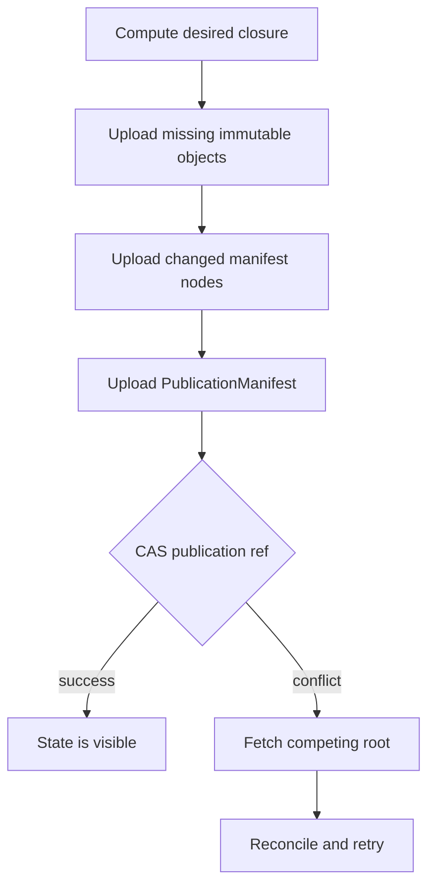

# Publication Manifest: Complete Bare Repository State

> Status: **draft / proposal.** Companion to
> [`view-snapshot-sync-design.md`](./view-snapshot-sync-design.md) and
> [`vault-sync-design.md`](./vault-sync-design.md). Those documents define the
> object models for views and vault data; this document defines the atomic
> publication boundary that makes all object families a complete, verifiable
> repository state.

## Summary

Atomic's bare protocol already has the correct storage primitives:

- immutable, content-addressed objects;
- mutable refs updated with compare-and-swap (CAS);
- view snapshots that identify change membership;
- a disposable redb read model rebuilt from objects.

What it does not yet have is one object that says:

> These view snapshots, changes, provenance graphs, attestations, tags, session
> artifacts, and vault entries are the complete repository state published by
> this transition.

Today, a view ref proves that its change closure is reachable. Auxiliary object
families are transferred independently. A clone or pull can therefore verify a
view's change set while silently lacking provenance, attestations, or future
vault data. Independent blobs are valuable storage units, but they are not a
transaction boundary.

The proposed model adds an immutable, content-addressed **publication manifest**
above the existing object families. A single authoritative ref points to the
current manifest. Publishing consists of uploading the complete immutable
closure and then atomically moving that ref with CAS.

```text
objects first, ref last
```

The manifest is the distributed commit record. A write-ahead log (WAL) may
announce manifest transitions or rebuild indexes, but it is not repository
truth.

## Goals

1. Make repository completeness verifiable from one root.
2. Publish related object families atomically without rewriting immutable data.
3. Preserve a bare server: object verification, closure validation, and ref CAS;
   no graph apply or materialization on the write path.
4. Support late-arriving provenance, attestations, and vault knowledge as normal
   repository transitions.
5. Permit selective fetch by typed reachability rather than project-wide scans.
6. Preserve multi-region convergence without a global sequence allocator or log
   leader.
7. Make redb and search indexes disposable, reproducible read models.

## Non-goals

- Replacing change dependency closure or patch theory.
- Putting mutable repository state inside object blobs.
- Requiring a total order across independent Atomic changes.
- Using a WAL as the canonical distributed history.
- Requiring all metadata for legacy or human-authored changes.
- Defining the final encoding or protocol version in this proposal.

## Problem statement

The current view-snapshot closure is approximately:

```text
refs/views/dev
    └── ViewSnapshot
          ├── own change keys
          ├── parent view relationship
          └── previous ViewSnapshot keys
```

Provenance and attestations are separate content-addressed objects associated
with changes through their payloads and local indexes:

```text
Change C        Provenance P        Attestation A
   │                 │                    │
   └──── explained by┘                    │
   └──────────── covered by ──────────────┘
```

The view snapshot does not commit to `P` or `A`. Consequently:

- `C` may be present while `P` is absent;
- the view's Merkle state and `SetId` may still verify;
- clone, pull, and push must each implement independent sidecar discovery;
- adding a new object family adds another inventory, transfer, and import path;
- the server cannot selectively fetch sidecars reachable from requested views;
- absence is ambiguous: intentional, pending, unsupported, or lost.

Future vault synchronization compounds this issue. A vault manifest can make
vault entries complete relative to a vault ref, but independent view and vault
refs still cannot publish a cross-family transition atomically. An agent turn
may produce a change, provenance graph, intent update, memory, and signed vault
attestations that should become visible as one publication.

## Core principle

**The publication ref is the only authoritative mutable value. Its target is an
immutable manifest whose reachable object closure is the complete published
repository state.**

```text
SOURCE OF TRUTH                           DERIVED READ MODELS
═══════════════                           ═══════════════════
refs/publication/current                  redb pristine graph
    │                                     session/provenance indexes
    ▼                                     vault knowledge graph
PublicationManifest                      embeddings and search indexes
    ├── views root                        materialized working copies
    ├── metadata root
    ├── vault root
    └── previous publication root(s)
```

A reader that has the publication manifest and every reachable object has the
complete state declared by that publication. A reader missing any required
object can identify the exact missing key and must not claim complete sync.

## Object model

### Typed object identity

Object keys must be qualified by family. A raw hash alone is not enough for
negotiation or reachability because different families may use different
canonical encodings and storage namespaces.

```rust
struct ObjectId {
    family: ObjectFamily,
    key: ObjectKey,
}

enum ObjectFamily {
    Change,
    Tag,
    Provenance,
    Attestation,
    ViewSnapshot,
    MetadataManifest,
    VaultEntry,
    VaultManifest,
    PublicationManifest,
}
```

`SyncWants::haves` should eventually become a typed set of `ObjectId` values.
This avoids namespace ambiguity and lets the server compute a precise typed
closure delta.

### Publication manifest

An illustrative shape is:

```rust
struct PublicationManifest {
    /// Encoding and semantic version for forward-compatible readers.
    version: u32,

    /// Repository identity to prevent cross-project replay.
    repository_id: RepositoryId,

    /// Immutable manifests containing the canonical key inventory for each
    /// object family. Each family manifest carries its own SetId.
    objects: ObjectFamilyManifests,

    /// The published view-name → ViewSnapshot mapping and optional vault head.
    view_heads: ObjectId,
    vault_head: Option<ObjectId>,

    /// Previous publication roots. Normally one; multiple after reconciliation.
    previous: Vec<ObjectId>,

    /// Creation metadata. Not used as repository ordering truth.
    created_at: i64,
    publisher: Option<PortableIdentity>,

    /// Optional signature over the canonical manifest bytes.
    proof: Option<DataIntegrityProof>,
}
```

The publication manifest stores one `SetId` per object family through
`ObjectFamilyManifests`. The family manifests contain the authoritative canonical
key inventories (full, sharded, or delta-encoded); their `SetId`s provide O(1),
order-independent equality and convergence checks. Large repositories shard or
delta-encode those inventories so a small transition rewrites only the affected
family path plus the publication manifest.

```rust
struct ObjectFamilyManifests {
    changes: ObjectSetManifest,
    tags: ObjectSetManifest,
    provenance: ObjectSetManifest,
    attestations: ObjectSetManifest,
    view_snapshots: ObjectSetManifest,
    vault_entries: Option<ObjectSetManifest>,
    vault_manifests: Option<ObjectSetManifest>,
}

struct ObjectSetManifest {
    /// Order-independent identity of this object family's complete published set.
    set_id: SetId,

    /// Content-addressed manifest containing the canonical keys, or a delta
    /// chain that reconstructs them. This remains the source of truth.
    inventory: ObjectId,
}
```

The publication's own content hash binds these family `SetId`s and inventories
to view heads, vault head, policy, repository identity, and publication lineage.
`SetId` answers whether two replicas hold the same family membership; the
publication hash answers whether they published the same repository semantics.

### Views root

The views root maps portable view names to immutable `ViewSnapshot` keys:

```rust
struct ViewsManifest {
    views: MerkleMap<ViewName, ObjectId>,
}
```

Existing view snapshots remain focused on view identity, lineage, parent
relationships, and change membership. The publication layer does not replace
view snapshots; it makes a selected set of their heads visible together.

Historical reproducibility requires a publication to reference concrete view
snapshot keys. A child snapshot may retain the user-facing parent view name, but
its published closure must resolve that name to a pinned parent snapshot through
the publication's views root. Reading an old publication must not silently use a
newer parent ref.

### Object-family SetIds

Every published object family has an independent `SetId` stored in its family
manifest. This is the manifest-level convergence contract:

```rust
changes.set_id       = SetId(changes)
tags.set_id          = SetId(tags)
provenance.set_id    = SetId(provenance objects)
attestations.set_id  = SetId(attestation objects)
view_snapshots.set_id = SetId(view snapshot objects)
vault_entries.set_id = SetId(vault entry objects)
```

This lets negotiation and verification identify exactly which family diverges
without walking unrelated inventories. The authoritative inventory still carries
or reconstructs the canonical object keys because `SetId` is a convergence
identity, not a trust boundary.

The current `SetId` contract in `atomic-core/src/types/set_id.rs` folds only
applyable change and tag hashes and explicitly excludes provenance and
attestation sidecars. Publication manifests therefore require a compatible
family-domain extension rather than silently feeding sidecars into the existing
change domain. One possible API is:

```rust
enum SetIdDomain {
    Changes,
    Tags,
    Provenance,
    Attestations,
    ViewSnapshots,
    VaultEntries,
    VaultManifests,
}

SetId::of_objects(domain, canonical_object_keys)
```

Each element expansion must bind the family domain and canonical object key:

```text
Blake3("atomic:setid:object:v1" || family || object_key)
```

The existing change-set `SetId` remains byte-for-byte stable. The new domain is
used only for publication object-family inventories.

The manifest also needs a portable association from changes to metadata. That
association may be derived from verified sidecar payloads, or represented by a
separate Merkle map:

```rust
struct ChangeMetadata {
    provenance: ProvenanceState,
    attestations: Vec<ObjectId>,
}

enum ProvenanceState {
    /// No provenance is expected, such as an explicitly human-authored or
    /// imported legacy change.
    Unattributed,

    /// Provenance is expected but publication is not yet complete.
    Pending,

    /// The declared provenance objects are present and verified.
    Complete(Vec<ObjectId>),
}
```

This removes the ambiguity between intentional absence and data loss. Policy can
then determine whether `Pending` is publishable for a particular view or change
author type.

### Vault root

The vault root points to the sharded, immutable vault manifest proposed in
[`vault-sync-design.md`](./vault-sync-design.md):

```text
VaultRoot
    ├── intents shard
    ├── memories shard
    ├── goals shard
    ├── sessions shard
    ├── skills shard
    └── signed vault attestations shard
```

Vault entries reference changes, files, acceptance criteria, tasks, and memories
using portable identities: hashes, URNs, and paths. Repository-local `NodeId`
values never appear in transported relationships.

## Required invariants

### 1. Content-address integrity

Every object must verify against the canonical hash algorithm for its family
before it can be considered reachable from a publication.

```text
verify(family, canonical_bytes, advertised_key) == true
```

A server may accept unreferenced uploads optimistically, but it must not publish
a root that reaches an invalid object.

### 2. Per-family SetId correctness

For every object family, recomputing `SetId` from the deduplicated canonical key
inventory must equal the `set_id` stored in that family's manifest. A mismatch
means the inventory is corrupt, incomplete, or was folded under the wrong family
domain.

`SetId` validation is necessary for convergence but insufficient for trust: the
receiver still verifies canonical inventory bytes, individual content addresses,
and the publication manifest hash.

### 3. Closure completeness

Before moving the publication ref, every required object reachable from the new
manifest must exist and pass structural validation.

Required closure includes:

- publication manifest nodes;
- views-manifest nodes and referenced view snapshots;
- each view's change membership and transitive change dependencies;
- required provenance and attestation objects;
- vault-manifest nodes and referenced vault entries;
- references required by the declared completeness policy.

### 4. Ref-last publication

Objects and manifest nodes are uploaded before the publication ref moves. The
ref CAS is the sole visibility boundary.

A partially uploaded closure is not published state.

### 5. Portable relationships

Transported objects may reference only identities stable across repositories:

- content hashes;
- typed object IDs;
- canonical URNs;
- repository-relative paths;
- portable actor identities.

Repository-local redb IDs, inode numbers, and table sequence numbers are derived
indexes and never cross the wire.

### 6. Deterministic canonicalization

Equivalent logical manifests must produce byte-identical canonical encodings.
Set and map order must be canonical. Concurrent reconciliation must not depend on
which replica observed an object first.

### 7. Monotonic immutable history

Publishing metadata never rewrites a change. Late evidence produces new metadata
and publication manifests that reference the existing change object.

### 8. Rebuildability

Given a publication root and its closure, a repository can rebuild:

- pristine graph tables;
- view indexes;
- change-to-provenance and change-to-attestation indexes;
- session manifests;
- vault knowledge graph and embeddings;
- a materialized working copy.

No derived database is required to prove repository truth.

## Publication protocol

### Push

```text
1. Read the current publication ref and manifest.
2. Compute the desired local publication closure.
3. Compare per-family SetIds to identify equal and divergent object families.
4. Negotiate canonical key deltas only for divergent families.
5. Upload missing immutable leaves.
6. Upload changed family inventories with their recomputed SetIds.
7. Upload the new PublicationManifest.
8. Request CAS(old_publication, new_publication).
9. Server validates family SetIds, the referenced closure, and policy.
10. CAS succeeds, or returns the current competing root.
```

The final CAS makes all referenced families visible together.



### Pull and clone

```text
1. Read the publication ref.
2. Fetch the PublicationManifest.
3. Select requested views and optional metadata/vault scopes.
4. Walk the typed reachable closure.
5. Subtract typed local haves.
6. Transfer the missing objects.
7. Verify each object and the complete selected closure.
8. Rebuild local indexes and materialize only after verification.
```

A client may support fetch profiles:

- `code`: view snapshots, changes, and required dependencies;
- `audit`: code plus provenance, attestations, and sessions;
- `vault`: selected vault shards and their cross-family references;
- `complete`: the full publication closure.

The profile changes what is intentionally selected, not whether the selected
closure is complete. A code-only clone must report that audit/vault families were
not requested rather than implying complete repository synchronization.

## Late-arriving metadata

Provenance and attestations often arrive after change serialization because an
agent turn records code first and finalizes its ledger or signature afterward.
This is not an exceptional repair path.

```text
Publication N
    change C
    metadata[C] = Pending

Publication N+1
    same change C
    new provenance P
    metadata[C] = Complete([P])
```

No change object or view membership needs to change. The client uploads `P`, the
changed metadata-manifest path, and a new publication manifest, then advances the
publication ref.

For workflows that require provenance atomically with code visibility, policy
must reject `Pending` at publication N. For workflows that allow eventual audit
completion, `Pending` is visible and machine-detectable rather than silently
missing.

## Concurrency and reconciliation

Two clients may publish concurrently from the same root:

```text
                  ┌── Publication A
Publication Base ─┤
                  └── Publication B
```

One CAS wins. The loser reads the winning root and reconciles:

- change and metadata sets use deterministic union where semantics are monotonic;
- view snapshot divergence uses the existing patch-set union rules;
- vault entry sets use deterministic union, with explicit conflict semantics for
  mutable logical identities;
- deletions, parent changes, scope changes, and supersession require explicit
  operations rather than blind set union.

The reconciled publication records both predecessors:

```text
Publication Merge {
    previous: [A, B],
    ...canonical reconciled roots
}
```

This preserves causal ancestry without imposing a global total order.

## Failure and recovery semantics

### Failure before ref CAS

Uploaded objects are unreachable. Readers continue using the old publication.
The writer can retry idempotently. Reachability GC may remove abandoned objects
after a retention window.

### CAS conflict

No partial state is visible. The client fetches the current root, reconciles,
and retries with a new manifest.

### Missing object during publication validation

The ref move is rejected with the missing typed object IDs. The writer uploads
them and retries.

### Missing object during read

The publication is corrupt or storage replication is incomplete. The client must
not claim successful verification. It can retry another replica or report the
exact missing family/key.

### Lost notification

Readers recover by reading the current publication ref. Event delivery is not
required for correctness.

### Derived database loss

Delete and rebuild it from the current publication closure. No authoritative
state is lost.

## Why a WAL is not the source of truth

A distributed WAL would introduce a sequencing authority for operations that are
otherwise immutable and often commutative. It requires:

- sequence allocation and fencing;
- leader election or consensus for multi-region writers;
- gap detection and replay;
- retention, checkpointing, and compaction;
- secondary indexes for selective fetch;
- rules for consumers that miss or reorder events.

A WAL record also does not by itself solve multi-object atomicity. To publish a
change, provenance graph, attestation, and vault update together, the record must
point to a manifest describing that closure. At that point the manifest is the
actual commit object and the WAL is only an observation stream.

A WAL or event stream remains useful for:

- announcing `old_root → new_root` transitions;
- cache invalidation;
- audit and operational telemetry;
- asynchronous read-model construction;
- analytics and billing;
- accelerating replica convergence.

Every consumer must treat events as duplicateable, reorderable, and lossy. The
recovery rule is always:

```text
read ref → fetch manifest → verify/reconcile closure
```

## Relationship to Git

The model borrows Git's strongest distribution property:

```text
immutable objects + tree/commit reachability + mutable refs
```

Atomic differs in important ways:

- view divergence reconciles patch sets rather than performing textual 3-way
  merges;
- manifests are typed across code, audit metadata, and durable agent knowledge;
- the canonical server store is object-store-native rather than packfile/POSIX
  oriented;
- redb is a derived semantic read model, not the distributed object truth;
- completeness policy can require provenance and attestations for AI-authored
  transitions.

The publication manifest is therefore commit-shaped, but it publishes an Atomic
repository knowledge graph rather than a Git filesystem tree.

## Security and trust

A publication manifest should support signatures over canonical bytes. Signature
verification establishes who authorized the root transition; content hashes
establish object integrity.

Server publication checks should include:

- authorization to move the repository publication ref;
- object-family hash verification;
- repository identity binding;
- rejection of cross-project object substitution where policy requires isolation;
- provenance/attestation signature verification where required;
- maximum object, manifest, and closure sizes;
- cycle detection in manifest and snapshot ancestry;
- policy checks for required audit completeness.

Signing the root does not automatically trust every sidecar author. Sidecars
retain their own identities and proofs; the root signature means the publisher
accepted those exact objects into repository state.

## Garbage collection

Immutable uploads may become unreachable because of interrupted pushes or lost
CAS races. Garbage collection is reachability-based:

1. Mark from all protected publication refs and retained historical roots.
2. Traverse typed manifests and object references.
3. Retain recently uploaded unreachable objects for a grace period.
4. Sweep old unmarked objects.

Historical retention policy determines whether all publication ancestry remains
reachable or older roots may be compacted into checkpoints.

In-flight uploads require leases, age thresholds, or upload-session markers so GC
does not delete objects before their publication CAS.

## Migration plan

### Phase 0: repair current sidecar parity

Before changing the protocol:

- clone imports provenance and attestations from `SyncPack`;
- pull imports both families consistently;
- push synchronizes sidecars for the full view closure, not only newly uploaded
  changes;
- sidecar-only pushes do not return early as "already up to date";
- reverse indexes are rebuilt or repaired from sidecar payloads.

This makes the existing protocol correct enough to migrate without losing known
objects.

### Phase 1: typed negotiation

- Replace untyped `haves: Vec<String>` with typed object IDs in a new protocol
  version.
- Preserve `sync/1` compatibility during rollout.
- Add shared import/verification code for every client operation.

### Phase 2: metadata and vault manifests

- Introduce immutable, sharded metadata manifests.
- Introduce immutable, sharded vault manifests.
- Define provenance completeness policy and portable change-to-metadata mapping.

### Phase 3: publication manifest and ref

- Add `PublicationManifest` encoding and validation.
- Add one authoritative publication ref per repository.
- Upload closure first and CAS the publication ref last.
- Continue updating legacy view/vault refs as compatibility projections.

### Phase 4: publication-root reads

- Clone and pull begin from the publication ref.
- Existing view refs become derived conveniences or aliases.
- Verification reports selected-profile completeness explicitly.

### Phase 5: derived indexes and GC

- Rebuild server read models from publication roots.
- Add reachability GC with grace periods and protected roots.
- Add optional root-transition events for cache and replica acceleration.

### Phase 6: retire legacy truth paths

- Stop treating independent family inventories as proof of completeness.
- Remove compatibility ref updates after supported clients migrate.
- Keep immutable object encodings where possible; migration should primarily add
  manifests and typed reachability rather than rewrite leaves.

## Open questions

1. Is the authoritative publication ref project-wide, or should shared release
   channels have independent publication refs?
2. Which object families are mandatory for the default clone profile?
3. Must agent-authored changes always publish with complete provenance, or may
   they transition through `Pending`?
4. Are graph-level attestations part of metadata, vault, or both through shared
   object references?
5. How are logical vault-entry updates and deletions reconciled under concurrent
   publication?
6. Should parent view snapshots be pinned directly in `ViewSnapshot`, or resolved
   through the publication's immutable views map?
7. What canonical Merkle map/set encoding should be shared by views, metadata,
   and vault manifests?
8. How long are losing-CAS and interrupted-upload objects retained before GC?
9. Which historical publication roots are protected permanently or by policy?
10. What signature policy applies to the publication root versus individual
    provenance, attestation, and vault objects?

## Decision summary

Adopt a hybrid model:

- **immutable content-addressed blobs** for all leaf object families;
- **per-object-family SetIds stored in canonical manifests** for O(1) convergence checks, with the inventories remaining authoritative for reachability and completeness;
- **one CAS-published publication root** as the atomic visibility boundary;
- **patch-theoretic deterministic reconciliation** for concurrent roots;
- **WAL/events only as an optional acceleration and audit plane**;
- **redb and search indexes only as rebuildable read models**.

The publication manifest does not replace Atomic's changes, view snapshots, or
vault objects. It makes them one verifiable repository state.
